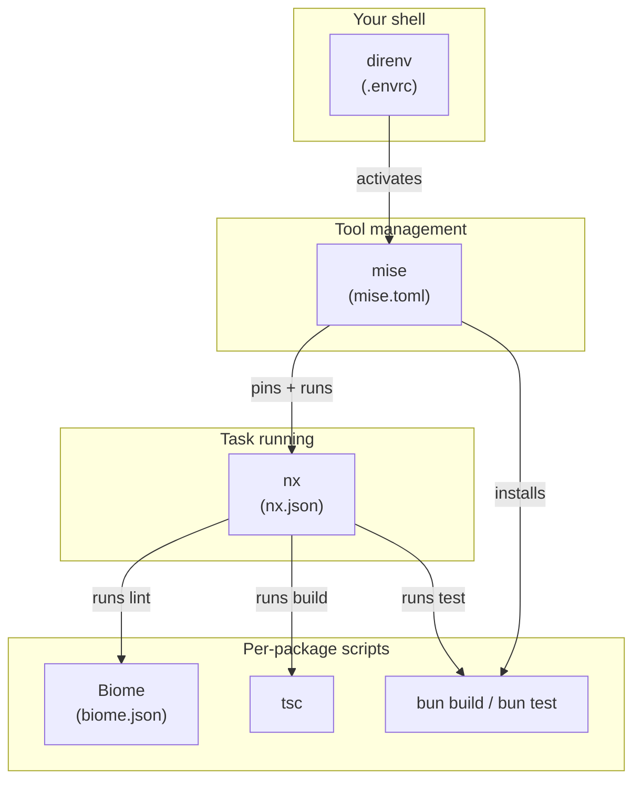

# farish Monorepo

How the farish repository is structured and built. This directory is both a
**spec** (the contract the tooling must satisfy) and a **user guide** (how to
work in the repo day to day). It implements steps 22–23 of
[`docs/INITIAL_PROMPT.md`][prompt].

[prompt]: ../INITIAL_PROMPT.md

## Toolchain at a glance

| Layer            | Tool        | Role                                           | Guide                        |
| ---------------- | ----------- | ---------------------------------------------- | ---------------------------- |
| Tool manager     | **mise**    | Pins bun/node/direnv; org-wide task entrypoints | [mise.md](./mise.md)         |
| Shell init       | **direnv**  | Activates the environment on `cd` into the repo | [direnv.md](./direnv.md)     |
| Runtime + PM     | **bun**     | JS/TS runtime, package manager, test runner     | [bun.md](./bun.md)           |
| Task runner      | **nx**      | Task graph, `dependsOn` ordering, caching       | [nx.md](./nx.md)             |
| Lint + format    | **Biome**   | One shared lint+format config + custom rules    | [lint-format.md](./lint-format.md) |

## How the layers fit together



A developer runs `mise run <task>`; mise invokes `nx`; nx walks the project
graph, orders tasks by their dependencies, caches results, and runs each
package's run-script. **CI runs the exact same `mise run` commands** — there is
no separate CI script path (initial prompt step 24).

## Quick start

```sh
# 1. Install direnv + hook it into your shell (once per machine)
mise use -g direnv
echo 'eval "$(direnv hook bash)"' >> ~/.bashrc   # zsh: direnv hook zsh

# 2. Enter the repo — direnv loads .envrc, mise installs pinned tools
cd farish
direnv allow

# 3. Install workspace dependencies
mise run bootstrap

# 4. Validate
mise run check          # lint + test + build — the CI gate
```

## Org-wide task commands

| Command              | Does                                            |
| -------------------- | ------------------------------------------------ |
| `mise run bootstrap` | `bun install` (workspace dependencies)           |
| `mise run lint`      | Biome lint across every package                  |
| `mise run format`    | Biome lint --fix (autofix) across every package  |
| `mise run test`      | `bun test` across every package                  |
| `mise run build`     | `tsc` build across every package (in dep order)  |
| `mise run check`     | lint + test + build — the full validation gate   |
| `mise run graph`     | Dump the nx project graph to `.nx-graph.json`    |

## Repository folder structure

See [folder-structure.md](./folder-structure.md) for the package-type layout
(`services/`, `apps/`, `lib/`, `packages/`, `plugins/`, `infra/`).

## Per-package contract

Every bun package in the workspace **must** define these run-scripts (initial
prompt step 22):

| Script    | Purpose                                              |
| --------- | ---------------------------------------------------- |
| `lint`    | Lint with Biome.                                     |
| `format`  | Lint with autofix (`lint --fix`).                    |
| `test`    | Run tests (`echo "no tests"` is acceptable if none). |
| `build`   | Produce `dist/` via `tsc`.                           |
| `release` | *(optional)* Packaging/publishing — publishable pkgs only. |
