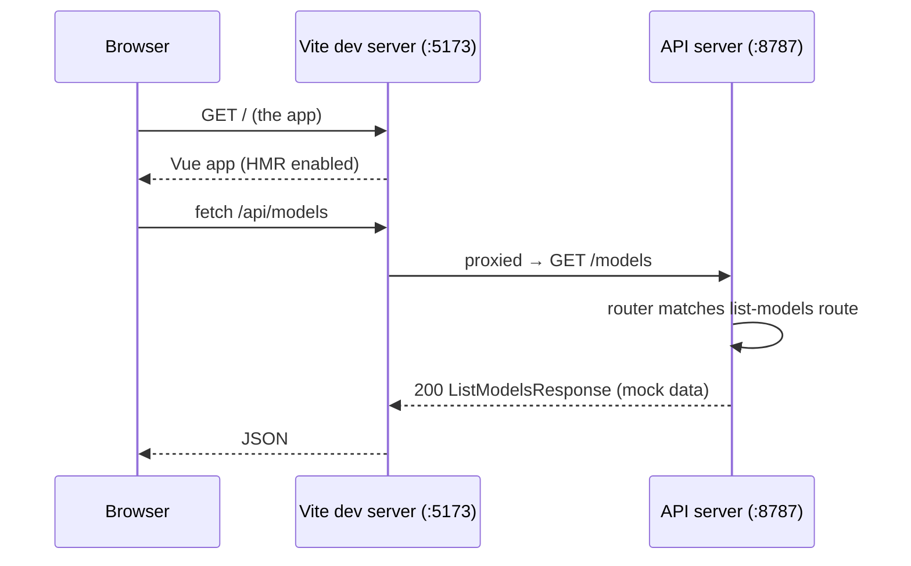
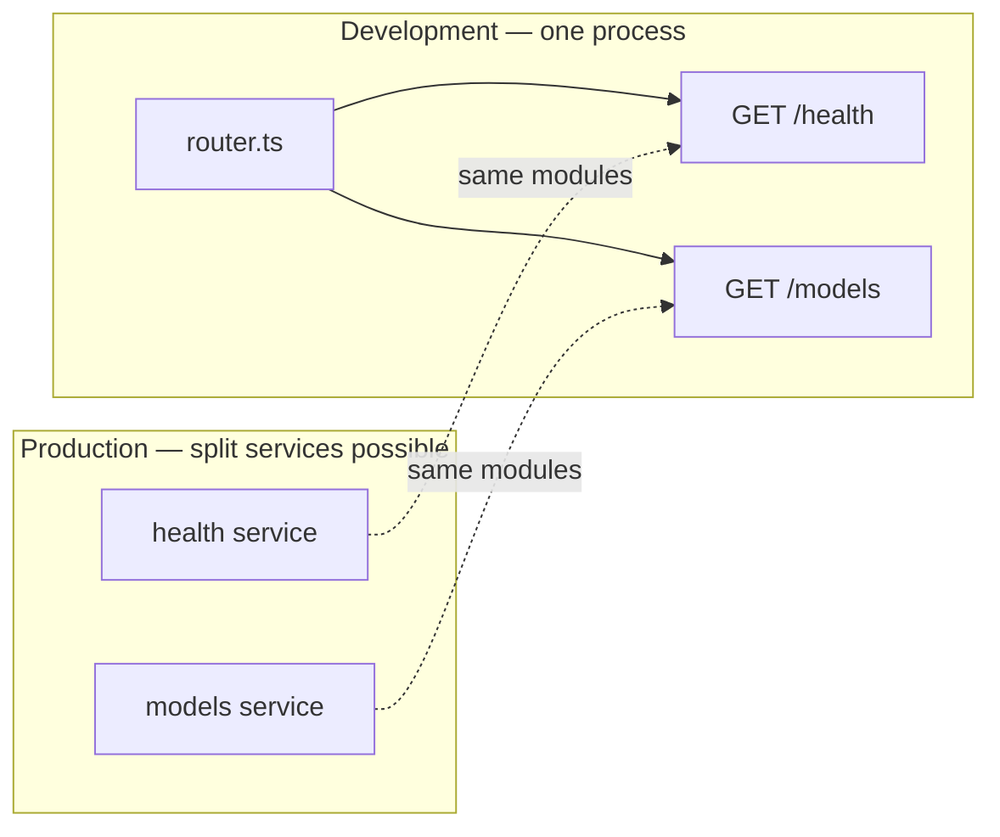

# App Framework Skeleton

How the farish application framework fits together (initial prompt step 26).

This document describes the **skeleton** — the framework plus one worked
end-to-end example. The 11 real pages and the eight real API endpoints are
filled in by later prompt steps; this is the scaffolding they build on.

## Pieces

| Package               | Kind    | Role                                                       |
| --------------------- | ------- | ---------------------------------------------------------- |
| `@farish/api`         | service | API server framework — router, `/health`, one example route |
| `@farish/web`         | app     | Vue 3 + Vuetify browser app — Vite dev + static GH Pages build |
| `@farish/api-contract`| lib     | Shared request/response types both sides depend on        |
| `@farish/mock-data`   | lib     | Lorem-ipsum + offline placeholder images for ghost wireframes |

## How a request flows



In development the Vite dev server proxies every `/api/*` request to the API
server, so the browser app calls the API same-origin (no CORS hop). In a
production GitHub Pages build the client uses `VITE_API_BASE_URL` instead.

## Microservice architecture

The API server is built **microservice-style**: each endpoint is an
independent route module ([`services/api/src/routes/`][routes]). One registry
([`routes/index.ts`][registry]) lists what the development server mounts —
a single process serving every route. When the API later splits into separate
deployable services, each service mounts the subset of that registry it owns;
no route module changes.



## Coming Soon mechanism

farish ships as a browser-only GitHub Pages site. Pages that need a shared
backend (Explore, Leaderboards, Profile) cannot work yet, so they render the
reusable **Coming Soon** mechanism: the eventual page content drawn as a
dimmed, blurred "ghost wireframe" (populated by `@farish/mock-data`) behind a
non-dismissible Coming Soon card.

```mermaid
flowchart TB
    view[ExploreComingSoonView] --> cs[ComingSoon component]
    cs --> ghost[Ghost wireframe — slot content, dimmed + blurred]
    cs --> card[Coming Soon card — overlay]
    ghost --> grid[GhostModelGrid — mock ModelCards]
    grid --> md[@farish/mock-data]
```

The component ([`ComingSoon.vue`][coming-soon]) takes the eventual page as a
slot, so every backend-gated page reuses it. `ExploreComingSoonView` is the one
worked example; the others are added with their pages in later steps.

## Running it locally

[Tilt](./tilt.md) brings the API server and the Vue dev server up together as
native processes:

```sh
mise run dev      # → tilt up
```

See [tilt.md](./tilt.md) for the resource graph and ports.

## Publishing

The static web app deploys to GitHub Pages. The API service is packaged as a
container image published to ghcr.io — see [infra/ghcr.md](../../infra/ghcr.md).
Local development never uses containers.

## See also

- [folder-structure.md](./folder-structure.md) — the package layout.
- [tilt.md](./tilt.md) — local dev orchestration.
- [infra/ghcr.md](../../infra/ghcr.md) — container publishing.
- [docs/api/API-SPEC.md](../api/API-SPEC.md) — the endpoint-spec contract.
- [docs/pages/coming-soon/SPEC.md](../pages/coming-soon/SPEC.md) — the Coming
  Soon page spec.

[routes]: https://github.com/nsheaps/farish/tree/claude/ai-3d-model-generator-XjoUi/services/api/src/routes
[registry]: https://github.com/nsheaps/farish/blob/claude/ai-3d-model-generator-XjoUi/services/api/src/routes/index.ts
[coming-soon]: https://github.com/nsheaps/farish/blob/claude/ai-3d-model-generator-XjoUi/apps/web/src/components/ComingSoon.vue
