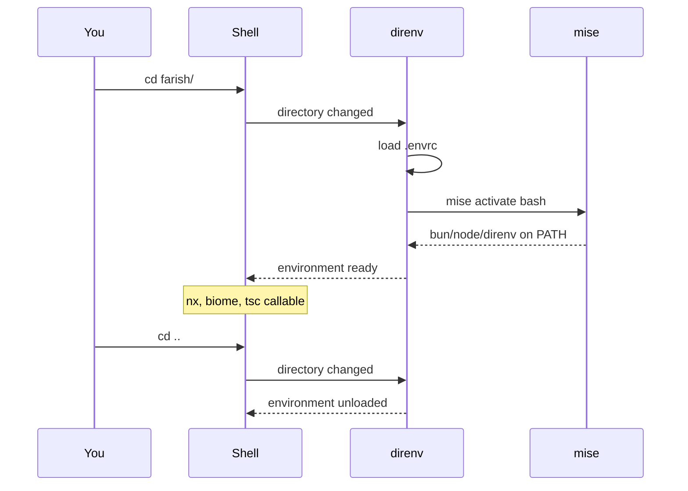

# direnv — Shell Initialization

[direnv][direnv] initializes the shell environment automatically when you `cd`
into the farish repo. This document is the spec for `.envrc`.

[direnv]: https://direnv.net

## Why direnv

Without direnv, every developer must remember to run `mise activate` (or source
some script) before working. direnv removes that step: the moment your shell
enters the repo directory, the environment is ready — and the moment you leave,
it is torn down.[^direnv-overview]



## `.envrc` — the spec

The `.envrc` file does two things:

1. **Activates mise** — `eval "$(mise activate bash)"` puts the pinned bun,
   node, and direnv versions on `PATH`.
2. **Adds workspace binaries** — `PATH_add node_modules/.bin` so `nx`, `biome`,
   and `tsc` are callable directly.

It also `watch_file`s `mise.toml` and `bun.lock` so direnv reloads automatically
when the toolchain changes.

## First-time setup (once per machine)

```sh
# 1. Install direnv (mise can do this, or use your OS package manager)
mise use -g direnv

# 2. Hook direnv into your shell — add to ~/.bashrc (or ~/.zshrc)
eval "$(direnv hook bash)"     # zsh: eval "$(direnv hook zsh)"

# 3. Approve the repo's .envrc (direnv blocks unknown .envrc files by design)
cd farish
direnv allow
```

After `direnv allow`, every future `cd farish` loads the environment with no
further action.

## Security model

direnv will **not** run an `.envrc` it has not been explicitly approved for. If
`.envrc` changes, direnv blocks it again until you re-run `direnv allow`. This
prevents a malicious branch from silently running shell code. Always read an
`.envrc` diff before approving it.[^direnv-security]

## Verifying it works

```sh
direnv exec . bash -c 'command -v bun node nx'
# expect: paths under mise installs + node_modules/.bin
```

`direnv exec .` loads `.envrc` for a single command — useful in scripts and CI
when a full shell hook is not wanted.

## Troubleshooting

| Symptom                               | Fix                                            |
| ------------------------------------- | ----------------------------------------------- |
| `direnv: error .envrc is blocked`     | Run `direnv allow` in the repo root.            |
| Tools not on PATH after `cd`          | direnv hook missing from `~/.bashrc` — add it.  |
| `mise: command not found` in `.envrc` | Install mise first (see [mise.md](./mise.md)).  |

## References

[^direnv-overview]: direnv — overview — <https://direnv.net/#getting-started>
[^direnv-security]: direnv — the `.envrc` security model — <https://direnv.net/man/direnv.1.html>
