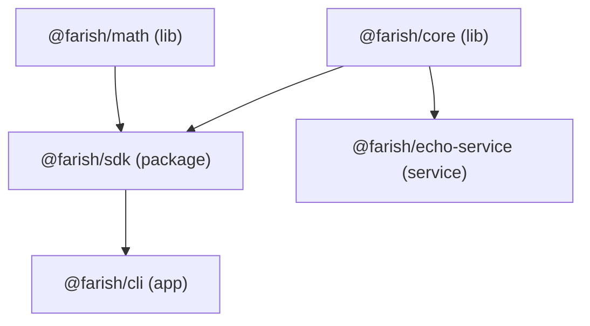
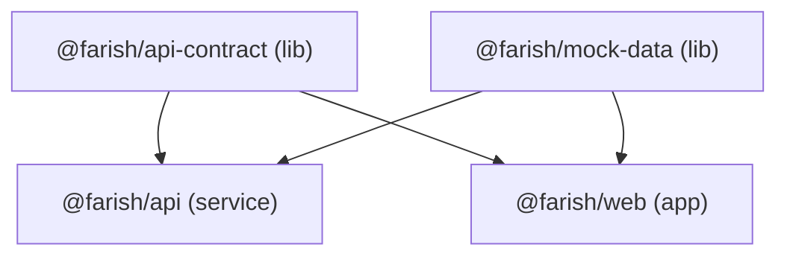

# Repository Folder Structure

The package-type layout of the farish monorepo (initial prompt step 23). Each
top-level folder holds one *kind* of package; the kind determines its
dependency rules and how it is built and run.

## Layout

```
farish/
├── lib/            shared-logic libraries — leaves of the dep graph
│   ├── core/         @farish/core         — greet(), PROJECT_NAME
│   ├── math/         @farish/math         — add(), clamp()
│   ├── api-contract/ @farish/api-contract — shared API request/response types
│   └── mock-data/    @farish/mock-data    — lorem + placeholder-image generators
├── packages/       published packages that wrap libs
│   └── sdk/          @farish/sdk          — depends on core + math
├── apps/           run-and-exit executables + browser apps
│   ├── cli/          @farish/cli          — depends on sdk
│   └── web/          @farish/web          — Vue 3 + Vuetify browser app (Vite)
├── services/       long-running services (APIs, background tasks)
│   ├── api/          @farish/api          — the farish API server (Bun)
│   └── echo-service/ @farish/echo-service — dummy bun HTTP server
├── plugins/        Claude Code plugin marketplace
│   └── farish-dx/    example plugin
├── infra/          infrastructure-as-code (deploy automation, ghcr.io)
├── .github/        CI integration — PR template + workflows
├── .mise/          mise task scripts
├── docs/           specs, research, and these guides
├── Tiltfile        local dev orchestration (API + web, native processes)
├── mise.toml       tool versions + org-wide tasks
├── nx.json         task graph + cache config
├── biome.json      shared lint + format config
├── tsconfig.base.json   shared strict TS options
├── tsconfig.json   solution file (references every tsc-built package)
└── package.json    bun workspace root
```

## Folder types

| Folder      | Holds                                          | Dependency rule                          |
| ----------- | ---------------------------------------------- | ---------------------------------------- |
| `lib/`      | Shared logic. **Leaves** — pure libraries.     | May depend only on other `lib/` packages.|
| `packages/` | Published things that aren't apps/services.    | May wrap `lib/` packages.                |
| `apps/`     | Things you run: CLIs, and the browser app.     | May depend on `lib/` and `packages/`.    |
| `services/` | Things that run continuously (APIs, workers).  | May depend on `lib/` and `packages/`.    |
| `plugins/`  | A Claude Code plugin marketplace.              | Not a bun workspace; managed separately. |
| `infra/`    | Infra-as-code for deploying the app.           | May depend on `lib/` and `packages/`.    |

The defining rule: **`lib/` packages are leaves** — they never depend on apps,
services, or packages. This keeps shared logic free of cycles.

## Dummy packages

Five of the workspace packages are deliberate **dummies** — `@farish/core`,
`@farish/math`, `@farish/sdk`, `@farish/cli`, and `@farish/echo-service`.
They are minimal real code whose only purpose is to exercise the toolchain
(nx graph, `dependsOn`, caching, lint, test, build). They are removed once the
real farish app fully replaces them in later prompt steps.



This shape gives nx a real graph: diamond fan-in at `sdk`, transitive depth at
`cli`, two independent leaves, and a separate `service` branch.

## App framework packages

Four packages form the real **app framework skeleton** (initial prompt
step 26). Unlike the dummies these stay and grow into the production app:



- **`@farish/api-contract`** — shared TypeScript types and route constants;
  imported by both the server and the browser app so payload shapes never drift.
- **`@farish/mock-data`** — deterministic lorem-ipsum text and offline
  placeholder images; powers the ghost wireframes behind Coming Soon pages.
- **`@farish/api`** — the microservice API server framework (Bun): a router,
  a `/health` endpoint, and one example endpoint stub.
- **`@farish/web`** — the Vue 3 + Vuetify browser app (Vite); built as a static
  site for GitHub Pages.

See [app-framework.md](./app-framework.md) for how these run together.

## What is **not** a bun workspace

- **`plugins/`** — a Claude Code plugin marketplace
  ([`.claude-plugin/marketplace.json`](https://github.com/nsheaps/farish/blob/claude/ai-3d-model-generator-XjoUi/plugins/.claude-plugin/marketplace.json)),
  not a bun package. It is excluded from the `workspaces` globs.
- **`infra/`**, **`.github/`**, **`.mise/`**, **`docs/`** — configuration and
  documentation, not code packages.

## See also

- [README.md](./README.md) — toolchain overview.
- [nx.md](./nx.md) — how the task graph reads these folders.
- [bun.md](./bun.md) — workspace + TypeScript configuration.
