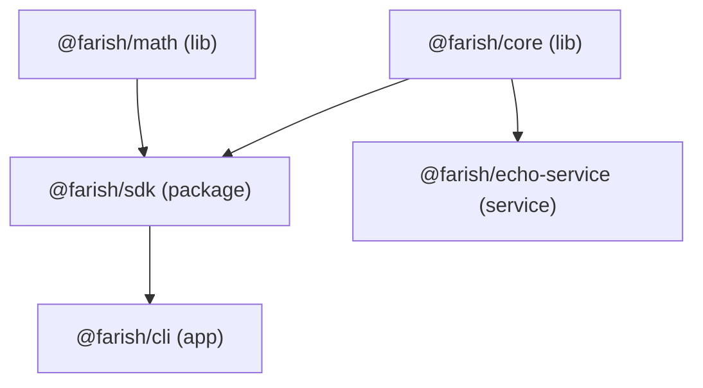

# Repository Folder Structure

The package-type layout of the farish monorepo (initial prompt step 23). Each
top-level folder holds one *kind* of package; the kind determines its
dependency rules and how it is built and run.

## Layout

```
farish/
├── lib/            shared-logic libraries — leaves of the dep graph
│   ├── core/         @farish/core   — greet(), PROJECT_NAME
│   └── math/         @farish/math   — add(), clamp()
├── packages/       published packages that wrap libs
│   └── sdk/          @farish/sdk    — depends on core + math
├── apps/           run-and-exit executables (CLIs)
│   └── cli/          @farish/cli    — depends on sdk
├── services/       long-running services (APIs, background tasks)
│   └── echo-service/ @farish/echo-service — depends on core; bun HTTP server
├── plugins/        Claude Code plugin marketplace
│   └── farish-dx/    example plugin
├── infra/          infrastructure-as-code (deploy automation)
├── .github/        CI integration — PR template + (later) workflows
├── .mise/          mise task scripts
├── docs/           specs, research, and these guides
├── mise.toml       tool versions + org-wide tasks
├── nx.json         task graph + cache config
├── biome.json      shared lint + format config
├── tsconfig.base.json   shared strict TS options
├── tsconfig.json   solution file (references every package)
└── package.json    bun workspace root
```

## Folder types

| Folder      | Holds                                          | Dependency rule                          |
| ----------- | ---------------------------------------------- | ---------------------------------------- |
| `lib/`      | Shared logic. **Leaves** — pure libraries.     | May depend only on other `lib/` packages.|
| `packages/` | Published things that aren't apps/services.    | May wrap `lib/` packages.                |
| `apps/`     | Things you run and that then exit (CLIs).      | May depend on `lib/` and `packages/`.    |
| `services/` | Things that run continuously (APIs, workers).  | May depend on `lib/` and `packages/`.    |
| `plugins/`  | A Claude Code plugin marketplace.              | Not a bun workspace; managed separately. |
| `infra/`    | Infra-as-code for deploying the app.           | May depend on `lib/` and `packages/`.    |

The defining rule: **`lib/` packages are leaves** — they never depend on apps,
services, or packages. This keeps shared logic free of cycles.

## Dummy packages

The five workspace packages are deliberate **dummies** — minimal real code whose
purpose is to exercise the toolchain (nx graph, `dependsOn`, caching, lint,
test, build). They are replaced with the real farish app in later prompt steps.



This shape gives nx a real graph: diamond fan-in at `sdk`, transitive depth at
`cli`, two independent leaves, and a separate `service` branch.

## What is **not** a bun workspace

- **`plugins/`** — a Claude Code plugin marketplace
  ([`.claude-plugin/marketplace.json`](https://github.com/nsheaps/farish/blob/claude/ai-3d-model-generator-XjoUi/plugins/.claude-plugin/marketplace.json)),
  not a bun package. It is excluded from the `workspaces` globs.
- **`infra/`**, **`.github/`**, **`.mise/`**, **`docs/`** — configuration and
  documentation, not code packages.

## See also

- [README.md](./README.md) — toolchain overview.
- [nx.md](./nx.md) — how the task graph reads these folders.
- [bun.md](./bun.md) — workspace + TypeScript configuration.
