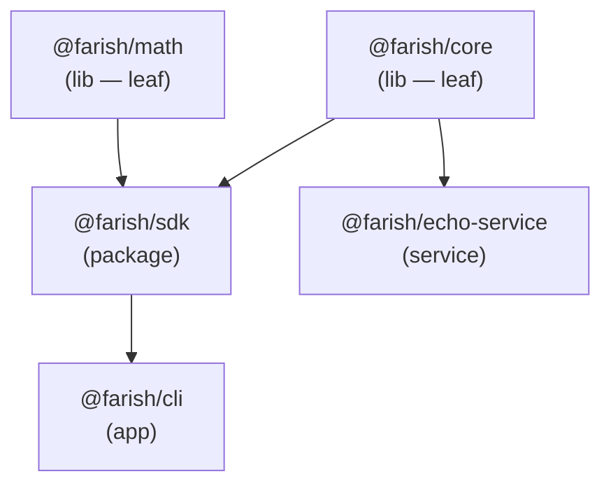

# nx — Monorepo Task Runner

[nx][nx] is farish's task runner. It builds a graph of every package, orders
tasks by their dependencies, and caches results. This document is the spec for
`nx.json` and the per-package `project.json` files.

[nx]: https://nx.dev

## Why nx

- **Correct task ordering.** nx reads the workspace dependency graph and runs a
  package's `build` only after its dependencies' `build`s — no manual
  sequencing.[^nx-graph]
- **Caching.** A task whose inputs are unchanged is restored from cache instead
  of re-run. Repeat `build`s on an unchanged tree are near-instant.[^nx-cache]
- **`run-many`.** One command (`nx run-many --target=build --all`) fans a task
  out across the whole workspace, in dependency order, with caching.[^nx-runmany]

## The project graph

nx infers the graph from each package's `dependencies` (the `workspace:*`
entries in `package.json`). For farish's dummy packages:



`@farish/sdk` fans in from two leaf libs; `@farish/cli` depends on `@farish/sdk`
(and transitively on both libs); `@farish/echo-service` depends on `@farish/core`.
This exercises diamond fan-in, transitive depth, and multiple leaves — enough
real structure to prove the task graph and caching work.

Dump the live graph any time:

```sh
mise run graph        # writes .nx-graph.json
nx graph              # opens the interactive browser view
```

## `nx.json` — the spec

### `targetDefaults` — dependency + cache rules

```json
"targetDefaults": {
  "build": { "dependsOn": ["^build"], "outputs": ["{projectRoot}/dist"], "cache": true },
  "lint":  { "cache": true },
  "test":  { "dependsOn": ["^build"], "cache": true },
  "format": { "cache": false }
}
```

- `dependsOn: ["^build"]` — the `^` means "dependency projects". So `build`
  (and `test`, which consumes built `.d.ts`) waits for **dependencies'** builds
  first. Running `nx build cli` builds `math` → `core` → `sdk` → `cli`.
- `outputs` — tells nx what `build` produces (`dist/`) so it can cache and
  restore the artifact.
- `cache: true` — the task is cacheable. `format` is **not** cached because it
  mutates files in place.

### `namedInputs` — what invalidates the cache

`production` excludes test files, so editing a `*.test.ts` does not bust a
dependent's `build` cache. `sharedGlobals` includes `tsconfig.base.json`,
`biome.json`, and `bun.lock` — changing any of those invalidates everything.

## `project.json` — per-package targets

Each package has a `project.json` mapping nx targets to its package.json
scripts via the `nx:run-script` executor:

```json
{
  "name": "core",
  "targets": {
    "build": { "executor": "nx:run-script", "options": { "script": "build" } }
  }
}
```

This keeps the package.json scripts (what bun runs) and the nx targets (what nx
schedules) as one source of truth.

## Running tasks

**Always go through `mise run`** — never call `nx` directly in docs, scripts,
or CI, so the local and CI codepaths stay identical (initial prompt step 24).

| Want to…                       | Command                               |
| ------------------------------ | ------------------------------------- |
| Build everything               | `mise run build`                      |
| Build one project + its deps   | `nx build <project>`                  |
| Run a specific target          | `nx run <project>:<target>`           |
| Lint/test/build everything     | `mise run check`                      |
| See the graph                  | `mise run graph`                      |
| Clear the cache                | `nx reset`                            |

Note: `nx release` is a reserved nx feature, **not** the per-package `release`
target. Invoke the release run-script with `nx run <project>:release`.

## Caching in action

```
$ nx build cli            # first run — 4 tasks executed
$ nx build cli            # second run:
  Nx read the output from the cache instead of running the command for 4 of 4 tasks.
```

## Adding a package to the graph

1. Create the package under the right folder (see
   [folder-structure.md](./folder-structure.md)).
2. Give it a `package.json` with the standard run-scripts.
3. Give it a `project.json` mapping targets to those scripts.
4. Declare workspace dependencies with `workspace:*` — nx picks up the edges
   automatically.

## References

[^nx-graph]: nx — project graph — <https://nx.dev/features/explore-graph>
[^nx-cache]: nx — caching — <https://nx.dev/features/cache-task-results>
[^nx-runmany]: nx — run tasks — <https://nx.dev/features/run-tasks>
