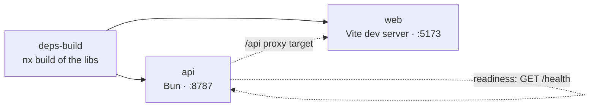

# Tilt — Local Development Orchestration

[Tilt][tilt] brings the whole farish local development stack up with a single
command. It is configured by the repo-root [`Tiltfile`](../../Tiltfile).

## Why Tilt, and why native processes

farish is a **browser-only app deployed to GitHub Pages**. There is no
container runtime in the deployment path, so local development uses **native
processes only** — every Tilt resource is a [`local_resource`][local-resource]
running a plain process on the host. No Docker, no Kubernetes (initial prompt
step 26).

Tilt still earns its place: it starts the API server and the Vue dev server
together, orders them by dependency, restarts the API on source changes, and
gives one dashboard for both process logs.

Container images exist only for **publishing** the API service — see
[`infra/ghcr.md`](../../infra/ghcr.md). Those images are never used for local
dev.

## Usage

```sh
mise run dev      # → tilt up
# or directly:
tilt up           # starts the stack + opens the Tilt UI
tilt down         # stops every resource
```

`tilt` itself is pinned in [`mise.toml`](../../mise.toml)
(`aqua:tilt-dev/tilt`), so `mise install` provides it at the same version for
everyone.

## Resources



| Resource     | What it runs                                   | Notes                                            |
| ------------ | ---------------------------------------------- | ------------------------------------------------ |
| `deps-build` | `nx run-many --target=build` for the workspace libs | The API + web app import the built `dist/`. |
| `api`        | `bun run --watch services/api/src/server.ts`   | Restarts on `services/api/src` changes. Readiness probe polls `GET /health`. |
| `web`        | `bun run --cwd apps/web dev` (Vite)            | Vite supplies HMR; depends on `api` so the `/api` proxy target is up first. |

## Ports

| Service | Port | Override                                  |
| ------- | ---- | ----------------------------------------- |
| API     | 8787 | `API_PORT` in the Tiltfile + `vite.config.ts` |
| Web     | 5173 | `WEB_PORT` in the Tiltfile                |

The Vite dev server proxies `/api/*` to the API server (see
[`apps/web/vite.config.ts`](../../apps/web/vite.config.ts)), so the browser app
calls the API same-origin during development.

## Validating the Tiltfile

The Tiltfile is Starlark. Parse and inspect it without starting anything:

```sh
tilt alpha tiltfile-result --file Tiltfile
```

This is also the basis of the `tilt ci` end-to-end workflow added in a later
prompt step (step 27).

## See also

- [`Tiltfile`](../../Tiltfile) — the orchestration definition.
- [mise.md](./mise.md) — how `tilt` is pinned and the `dev` task.
- [infra/ghcr.md](../../infra/ghcr.md) — container publishing (separate from dev).

[tilt]: https://tilt.dev
[local-resource]: https://docs.tilt.dev/local_resource.html
