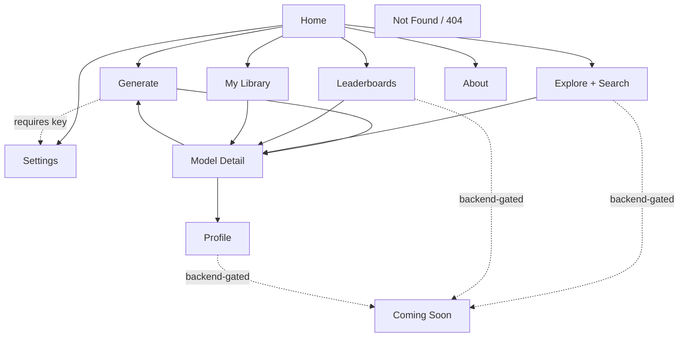

# Site Pages — Index (draft)

Draft page inventory for **farish**, the AI 3D-model generator. Derived from
[`docs/INITIAL_PROMPT.md`][prompt]. This is a **first-pass draft** (prompt
steps 5–7): page titles and one or two sentences each — no detailed specs yet.
Each page gets its own `docs/pages/<slug>/SPEC.md` in a later step.

[prompt]: ../INITIAL_PROMPT.md

## Browser-only vs. backend-dependent

farish is built to run as a browser-only static site on GitHub Pages for now.
The AI generator and a per-browser local library work fully client-side. The
social layer (shared galleries, ratings, view counts, public profiles,
cross-user search) needs a shared backend; until a Vercel backend exists
(amendment A3 in the initial prompt) those pages ship as **Coming Soon**
placeholders behind a ghost wireframe rendered with mock data. Each page below
is tagged accordingly.

| Tag            | Meaning                                                   |
| -------------- | --------------------------------------------------------- |
| `browser-only` | Works fully client-side; ships functional.                |
| `backend`      | Needs a shared backend; ships as Coming Soon until built. |
| `static`       | Static content, no data dependency.                       |
| `system`       | Framework / utility page.                                 |

## Sitemap

## Pages

### Discover

1. **Home** — `home` — `static`
   The landing page: what farish does, the primary call-to-action into
   Generate, and a preview strip of trending models (the strip is a
   backend-enhanced extra that degrades gracefully when offline).

2. **Explore** — `explore` — `backend`
   The browsable gallery of shared models with search, sort, and filter
   controls — search is a first-class mode of this page, not a separate route.
   Covers the query, empty, and no-results states.

3. **Leaderboards** — `leaderboards` — `backend`
   Three ranked boards — Best Rated, Most Rated (Popular), and Most Viewed —
   each filterable by time bucket: 1 week, 1 month, 1 year, all time.

### Create

4. **Generate** — `generate` — `browser-only`
   The core feature: enter a prompt, configure model parameters, answer
   spec-clarification questions when the prompt is underspecified, and watch
   the live generation loop produce a 3D model. Prompts inline to connect a
   key (linking to Settings) when none is set — no separate onboarding page.

5. **Model Detail** — `model-detail` — `browser-only` viewer, `backend` social
   An interactive 3D viewer for a single model alongside its prompt,
   parameters, and metadata, plus download, share, and rating actions.

### Account

6. **My Library** — `my-library` — `browser-only`
   The current user's own generated models, stored in the browser so the
   library works offline and without an account.

7. **Profile** — `profile` — `backend`
   A public user's models and stats — their shared creations and rankings.

8. **Settings** — `settings` — `browser-only`
   Connect a Claude account (login-with-Claude) or enter an API key, manage
   preferences, and read how credentials are stored locally. This page is also
   the login/connect surface — no separate Login page.

### System

9. **About** — `about` — `static`
   Project background — William Farish and the history of isometric
   projection — how generation works, and the credential-privacy explanation.

10. **Coming Soon** — `coming-soon` — `system`
    A reusable placeholder for backend-dependent pages before the backend
    exists: a ghost wireframe rendered with mock data behind a "coming soon"
    overlay.

11. **Not Found** — `not-found` — `system`
    The 404 page for unknown routes.

## Review notes (step 6)

Resolved from the first draft's open questions:

- **Search folded into Explore.** Search and a browse gallery share the same
  card grid and states; search is a mode of Explore, not a separate page or
  spec. Models remain fully searchable — via Explore's search control.
- **No separate onboarding page.** Generate prompts inline to connect a key
  (deep-linking to Settings) when none is present.
- **No separate Login/Connect page.** Settings is the connect surface.

Result: **11 pages** (down from 12). Reviewed a second time (step 7) — no
further changes; the set is complete and each page maps cleanly to a flow in
the initial prompt.
