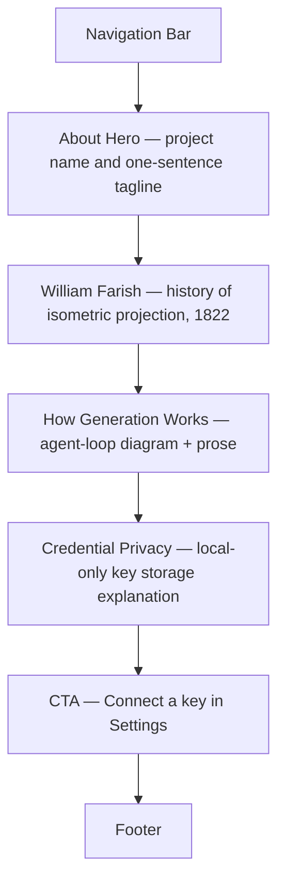

# About

## Summary

A narrative page covering three topics: the history of William Farish and
isometric projection that inspired the project name; a plain-language
explanation of how AI model generation works; and the credential privacy
model — why users' API keys are safe.[^1] No dynamic data; the page is fully
static.

## Route & Access

- **Route:** `/about`
- **Tag:** `static` — no backend or API key required.[^2]
- **Preconditions:** None. Publicly accessible to any visitor.

## Users & Entry Points

- **Curious visitors** wanting context on the project's name and purpose.
- **Privacy-conscious users** investigating how credentials are handled before
  connecting a key.
- Entry from: Home Footer "About" link;
  [`../settings/SPEC.md`](../settings/SPEC.md) credential-privacy detail link.

## Layout

## Components

- **NavBar** — site-wide navigation bar; links to Generate, Explore,
  Leaderboards, My Library, and Settings.
- **AboutHero** — page heading ("About farish") and a one-sentence tagline
  describing the project.
- **FarishHistory** — prose section about William Farish (1759–1837) and his
  1822 formalization of isometric projection; explains why the project is named
  after him.[^3]
- **GenerationDiagram** — Mermaid sequence diagram illustrating the generation
  loop: user prompt → Claude Agent SDK → tool calls → geometry output → viewer.
- **HowItWorksProse** — brief plain-language companion text to the diagram.
- **PrivacySection** — explanation that API keys and OAuth tokens are stored
  in `localStorage` on the user's device and are never transmitted to farish
  servers.
- **SettingsCTA** — secondary CTA button "Connect your key in Settings" linking
  to [`../settings/SPEC.md`](../settings/SPEC.md).
- **Footer** — site footer with links to the project GitHub repository.

## States

| State     | Trigger    | Renders            |
| --------- | ---------- | ------------------ |
| `default` | Page loads | Full static content |

## Interactions

- **Click SettingsCTA** → navigate to `/settings`.
- **NavBar links** → navigate to the respective page.

## Data

_None._ The page is fully static — no local or remote data dependencies.

## Navigation

**In-links:** Home Footer "About" link; Settings "learn more" credential
privacy link.

**Out-links:**
- `/settings` — SettingsCTA button

## Responsive

Desktop (default): content in a centered reading column (max-width ~720 px)
with comfortable line length. GenerationDiagram renders at full column width.
Mobile/narrow: full-width single column; diagram scrolls horizontally if wider
than the viewport.

## Open Questions

- **About link placement.** Currently only the Home and About pages include a
  Footer with the About link, so About is not reachable from most inner pages.
  Decide whether to add a site-wide Footer to all pages or promote About to a
  NavBar link before wireframing.[^4]

## References

[^1]: Initial prompt — "project background — William Farish and the history of
      isometric projection — how generation works, and the credential-privacy
      explanation" — [`../INITIAL_PROMPT.md`](../INITIAL_PROMPT.md).
[^2]: INDEX.md — About tagged `static` —
      [`../INDEX.md`](../INDEX.md).
[^3]: William Farish (scientist), Wikipedia —
      <https://en.wikipedia.org/wiki/William_Farish_(scientist)>.
[^4]: INDEX.md — only Home and About include a Footer section in their layouts —
      [`../INDEX.md`](../INDEX.md).
