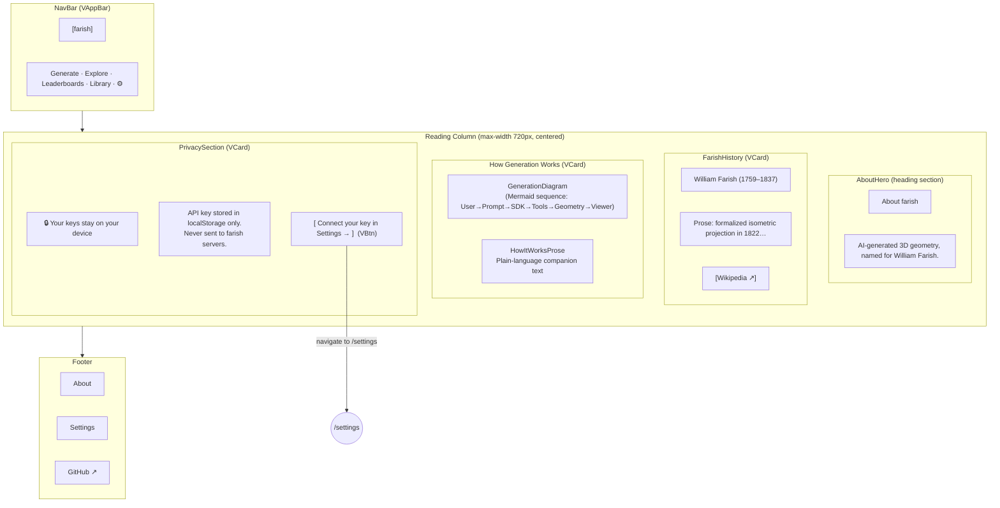

# About — Visual Wireframe

## Component Key

| Wireframe Label    | Vuetify 3 Component                              |
| ------------------ | ------------------------------------------------ |
| NavBar             | `VAppBar` + `VBtn`                               |
| AboutHero          | Heading `<section>` or `VCard` (hero variant)    |
| FarishHistory      | `VCard` with text content                        |
| GenerationDiagram  | Mermaid `sequenceDiagram` embedded in `VCard`    |
| HowItWorksProse    | `
` text within the same `VCard`               |
| PrivacySection     | `VCard` (type="info" or custom)                  |
| SettingsCTA        | `VBtn` (variant="text" or "outlined")            |
| Footer             | Static `<footer>` with `VBtn` text links         |

## State Impact

Single state only (`default`). No dynamic data — fully static page.
