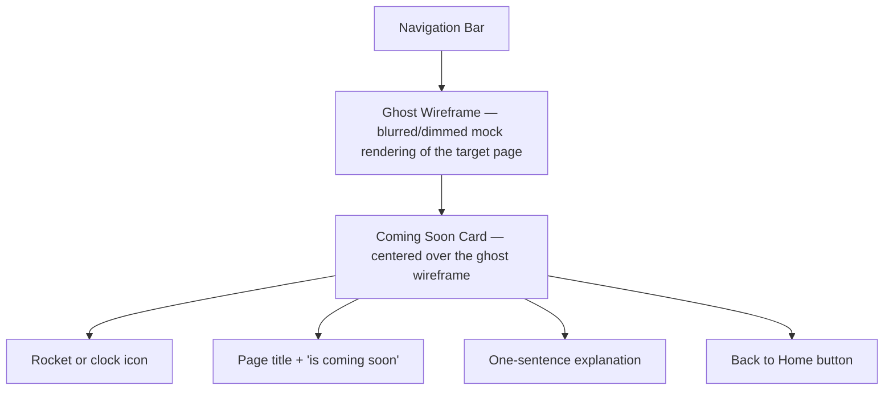

# Coming Soon

## Summary

A reusable placeholder for backend-dependent pages before the shared backend
exists. It renders a ghost wireframe of the target page (populated with mock
data and placeholder thumbnails) behind a centered "Coming Soon" overlay card.
The preferred pattern is an in-page overlay so the user stays on the target
route; `/coming-soon` exists as a direct fallback route.[^1]

## Route & Access

- **Route:** `/coming-soon` — direct fallback route; also used as an in-page
  overlay component rendered by backend-dependent pages at their own routes.
- **Tag:** `system` — infrastructure page, no data dependency.[^2]
- **Preconditions:** None.

## Users & Entry Points

- **Any user** who navigates to a backend-dependent page (Explore, Leaderboards,
  Profile) before the backend is live. The target page renders this overlay at
  its own URL rather than redirecting.
- Entry from: [`../explore/SPEC.md`](../explore/SPEC.md) (in-page overlay);
  [`../leaderboards/SPEC.md`](../leaderboards/SPEC.md) (in-page overlay);
  [`../profile/SPEC.md`](../profile/SPEC.md) (in-page overlay); any internal
  link that would reach a backend-gated feature.

## Layout

## Components

- **GhostWireframe** — a dimmed (e.g. 30 % opacity, blurred) rendering of the
  target page using hardcoded mock data (lorem ipsum titles, placeholder
  thumbnail images). Makes the future design tangible without real data.
- **ComingSoonCard** — centered modal-style card containing the icon, headline,
  note, and action button. Not dismissible.
- **HomeButton** — secondary button navigating to `/`.
- **PageIcon** — contextual icon representing the target page category
  (e.g. gallery icon for Explore, trophy for Leaderboards).

## States

| State     | Trigger    | Renders                                             |
| --------- | ---------- | --------------------------------------------------- |
| `default` | Page loads | Ghost wireframe + ComingSoonCard overlay (centered) |

## Interactions

- **Click Back to Home** → navigate to `/`.
- **NavBar links** → navigate to the respective page normally.

## Data

- `targetPageName` — the human-readable name of the coming-soon page (e.g.
  "Explore"). `local` (passed as a route param or component prop).
- Ghost wireframe mock data is hardcoded static content — no storage or
  remote call.

## Navigation

**In-links:** Explore, Leaderboards, and Profile pages render this as an
in-page overlay at their own routes. The `/coming-soon` route is a direct
fallback.

**Out-links:**
- `/` — HomeButton

## Responsive

Desktop (default): ghost wireframe fills the viewport below the NavBar;
ComingSoonCard is centered with ~480 px max-width. Mobile/narrow: card
occupies most of the viewport width; ghost wireframe is less prominent
(lower opacity or replaced with a solid dimmed background).

## Open Questions

- **Overlay vs. redirect.** The in-page overlay pattern (stays on `/explore`,
  `/leaderboards`, `/u/:username`) is preferred because it shows users what the
  page will look like. Confirm this over a full redirect to `/coming-soon`.[^3]
- **Mock data freshness.** The ghost wireframe uses static mock thumbnails and
  titles. These should be visually plausible but need no maintenance; confirm
  during wireframing step.

## References

[^1]: Initial prompt — "a reusable placeholder … ghost wireframe rendered with
      mock data behind it" — [`../INITIAL_PROMPT.md`](../INITIAL_PROMPT.md).
[^2]: INDEX.md — Coming Soon tagged `system` —
      [`../INDEX.md`](../INDEX.md).
[^3]: Explore spec for context on how the overlay is used —
      [`../explore/SPEC.md`](../explore/SPEC.md).
