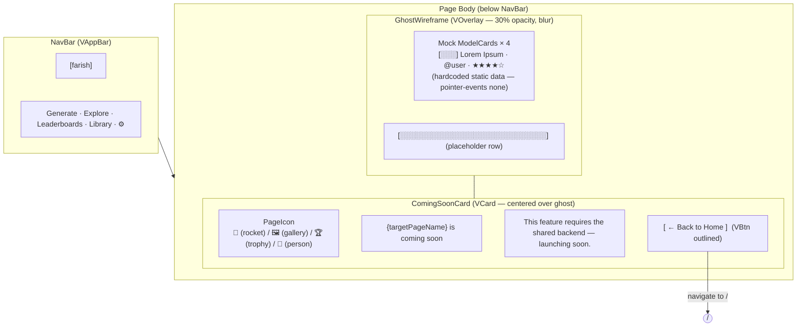

# Coming Soon — Visual Wireframe

## Component Key

| Wireframe Label    | Vuetify 3 Component                                               |
| ------------------ | ----------------------------------------------------------------- |
| NavBar             | `VAppBar` + `VBtn`                                                |
| GhostWireframe     | `VOverlay` (opacity 0.3, pointer-events none) wrapping mock cards |
| GhostCards         | `VCard` (same as ModelCard, hardcoded mock data)                  |
| ComingSoonCard     | `VCard` (max-width 480px, elevation 8)                            |
| PageIcon           | `VIcon` (`mdi-rocket`, `mdi-image-multiple`, `mdi-trophy`, `mdi-account`) |
| HomeButton         | `VBtn` (variant="outlined")                                       |

## State Impact

Single state only (`default`). `targetPageName` is passed as a route param or
component prop to customise the headline and icon.
