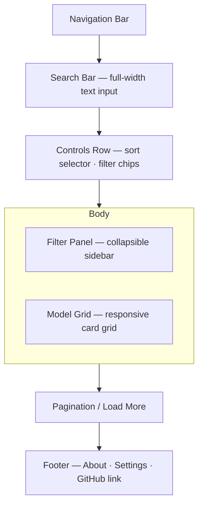

# Explore

## Summary

The browsable gallery of publicly shared models. Search, sort, and filter
controls are first-class — search is a mode of this page, not a separate route.
The page ships as a Coming Soon placeholder until the shared backend exists;
the spec describes the full intended design for post-backend implementation.[^1]

## Route & Access

- **Route:** `/explore`
- **Tag:** `backend` — ships as Coming Soon; full functionality requires the
  shared model store.[^2]
- **Preconditions:** None for browsing (public gallery). Sharing a model (the
  action that populates this gallery) requires a connected Claude account or API
  key set in [`../settings/SPEC.md`](../settings/SPEC.md).

## Users & Entry Points

- **Browsers** wanting to discover shared community models.
- **Searchers** arriving with a specific topic or keyword in mind.
- Entry from: NavBar (all pages), Home hero secondary links, Model Detail "by
  this author" or "similar models" links.

## Layout

## Components

- **NavBar** — site-wide navigation bar; links to Generate, Explore,
  Leaderboards, My Library, and Settings.
- **SearchBar** — debounced text input; updates `?q=` URL param on change.
- **SortSelector** — dropdown: Newest, Highest Rated, Most Popular, Most Viewed.
- **FilterChips** — active filters shown as removable chips in the controls row.
- **FilterPanel** — sidebar with category/tag checkboxes; collapses to a
  bottom-sheet drawer on mobile.
- **ModelGrid** — responsive grid rendering `ModelCard` for each result.
- **ModelCard** — thumbnail, title, author chip, rating stars, view count;
  links to [`../model-detail/SPEC.md`](../model-detail/SPEC.md).
- **EmptyState** — illustration + "No models yet" message (empty gallery).
- **NoResultsState** — "No matches for '{query}'" + Clear Search button.
- **ComingSoonOverlay** — full-page overlay from [`../coming-soon/SPEC.md`](../coming-soon/SPEC.md)
  rendered until backend is live.
- **Footer** — site-wide footer with links to About, Settings, and the project
  GitHub repository.

## States

| State          | Trigger                        | Renders                                             |
| -------------- | ------------------------------ | --------------------------------------------------- |
| `coming-soon`  | Backend not yet live           | ComingSoonOverlay over ghost wireframe               |
| `default`      | Gallery loaded, no query       | SearchBar + Controls + populated ModelGrid          |
| `loading`      | Fetch in flight                | Controls + ModelGrid with skeleton cards            |
| `empty`        | Zero models in the store       | EmptyState illustration                             |
| `no-results`   | Query returns zero matches     | NoResultsState + Clear Search button                |
| `error`        | Fetch failed                   | Inline error card with Retry button                 |

## Interactions

- **Type in SearchBar** → debounce 300 ms → update `?q=` param → re-fetch results.
- **Change sort** → update `?sort=` param → re-fetch.
- **Toggle a filter** → update `?filter=` param → re-fetch.
- **Remove a filter chip** → remove that param → re-fetch.
- **Click ModelCard** → navigate to `/m/:modelId`.
- **Click author chip** → navigate to `/u/:username`.
- **Click Load More / scroll to bottom** → fetch next page and append cards.
- **Click Clear Search** (no-results state) → clear `?q=` → return to default.

## Data

- `models` — paginated list of shared models (id, title, thumbnailUrl,
  authorName, authorUsername, ratingAvg, viewCount, createdAt). `remote`, read-only.
- `query` — active search text. `local` (URL param `?q=`).
- `sortBy` — active sort field (newest|rating|popular|views). `local` (URL
  param `?sort=`).
- `filters` — active category/tag filter set. `local` (URL param `?filter=`).
- `cursor` — pagination cursor or page number. `local` (URL param `?page=`).

## Navigation

**In-links:** NavBar (all pages); Home hero secondary CTA; browser back from
Model Detail.

**Out-links:**
- `/m/:modelId` — ModelCard click
- `/u/:username` — author chip click
- `/about`, `/settings`, GitHub — Footer links (present on all pages)

## Responsive

Desktop (default): FilterPanel fixed sidebar on the left; ModelGrid 3–4
columns; SearchBar and Controls in a top bar row. Mobile/narrow: FilterPanel
collapses into a bottom-sheet drawer triggered by a "Filters" button;
ModelGrid drops to 2 columns; SearchBar and sort selector stack vertically.

## Open Questions

- **Infinite scroll vs. pagination.** Defaulting to infinite scroll (Load More
  button at bottom) for a gallery feel; confirm before wireframing.[^3]
- **Filter taxonomy.** Category/tag list is unknown until models are generated;
  defer to API design step.

## References

[^1]: Initial prompt — "browsable gallery of shared models with search, sort,
      and filter controls" — [`../INITIAL_PROMPT.md`](../INITIAL_PROMPT.md).
[^2]: INDEX.md — Explore tagged `backend`, ships as Coming Soon —
      [`../INDEX.md`](../INDEX.md).
[^3]: Coming Soon placeholder design —
      [`../coming-soon/SPEC.md`](../coming-soon/SPEC.md).
