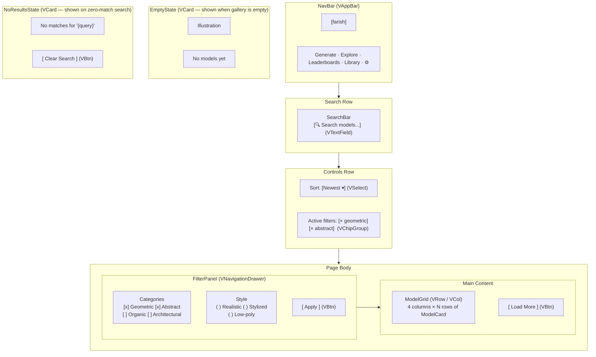

# Explore — Visual Wireframe

## Component Key

| Wireframe Label    | Vuetify 3 Component                                          |
| ------------------ | ------------------------------------------------------------ |
| NavBar             | `VAppBar` + `VBtn`                                           |
| SearchBar          | `VTextField` with `append-inner-icon="mdi-magnify"`          |
| SortSelector       | `VSelect`                                                    |
| FilterChips        | `VChip` + `VChipGroup` (closable chips)                      |
| FilterPanel        | `VNavigationDrawer` (permanent on desktop, bottom on mobile) |
| ModelGrid          | `VRow` / `VCol` (cols="12" sm="6" md="4" lg="3")            |
| ModelCard          | `VCard` + `VRating`                                          |
| EmptyState         | `VCard` with centered illustration slot                      |
| NoResultsState     | `VCard` with text + `VBtn`                                   |
| LoadMore           | `VBtn` (variant="text" or "outlined")                        |

## State Impact

- **`coming-soon`**: Full-page `VOverlay` with ghost wireframe behind `ComingSoonCard`; see `coming-soon-overlay.ascii.md`.
- **`loading`**: ModelGrid cards replaced by `VSkeletonLoader`.
- **`empty`**: Body content replaced by `EmptyState`.
- **`no-results`**: ModelGrid replaced by `NoResultsState`.
- **`error`**: ModelGrid replaced by inline error `VCard` + Retry `VBtn`.
