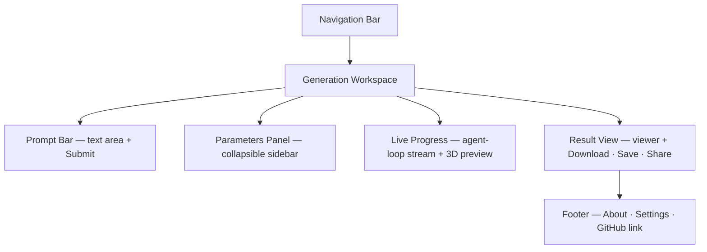

# Generate

## Summary

The core feature page. Users enter a natural language prompt, configure model
parameters, answer AI-driven clarification questions when the prompt is
underspecified, and watch the live agent loop produce a 3D model.[^1] When no
API key is configured, the page prompts inline to connect one via Settings —
there is no separate onboarding page.[^2]

## Route & Access

- **Route:** `/generate`
- **Tag:** `browser-only` — runs entirely in the browser; all AI calls originate
  from the client using the user's own Claude API key or OAuth token.[^1]
- **Preconditions (soft):** A Claude API key or OAuth token set in
  [`../settings/SPEC.md`](../settings/SPEC.md). Without one, the page renders
  a `no-key` banner rather than blocking navigation.

## Users & Entry Points

- **New creators** arriving from the Home CTA or NavBar.
- **Returning creators** bookmarking the page or navigating from My Library.
- **Remixers** arriving from Model Detail ("Generate similar").
- May receive a deep-link with a pre-filled prompt via URL param `?prompt=`.

## Layout

## Components

- **NavBar** — site-wide navigation bar; links to Generate, Explore,
  Leaderboards, My Library, and Settings.
- **NoKeyBanner** — inline banner shown when no API key is set; links to
  [`../settings/SPEC.md`](../settings/SPEC.md).
- **PromptBar** — multiline text area with a Submit / Generate button; accepts
  optional `?prompt=` URL param to pre-fill.
- **ParametersPanel** — collapsible sidebar with controls for geometry
  resolution, artistic style, and complexity level.
- **ClarificationDialog** — inline panel where the AI asks follow-up questions
  when the prompt is underspecified; user answers before generation starts.
- **GenerationStream** — live scrolling feed of agent-loop steps (tokens,
  tool calls, progress events) streamed via the Claude Agent SDK.[^3]
- **ModelPreview** — real-time 3D viewer that updates as geometry is produced.
- **ResultActions** — Download, Save to Library, and Share buttons shown after
  generation completes.
- **ErrorPanel** — generation error description + Retry button.
- **Footer** — site-wide footer with links to About, Settings, and the project
  GitHub repository.

## States

| State         | Trigger                                  | Renders                                                         |
| ------------- | ---------------------------------------- | --------------------------------------------------------------- |
| `no-key`      | No API key/OAuth token in storage        | NoKeyBanner above PromptBar; Generate button disabled           |
| `idle`        | Key set, no active generation            | PromptBar + ParametersPanel; Generate button enabled            |
| `specifying`  | Prompt submitted, AI needs clarification | ClarificationDialog; PromptBar locked                           |
| `generating`  | Generation agent loop running            | GenerationStream + live ModelPreview; Cancel button available   |
| `complete`    | Model geometry produced                  | ModelPreview (final) + ResultActions                            |
| `error`       | Generation failed or cancelled           | ErrorPanel with error detail + Retry button                     |

## Interactions

- **Type in PromptBar** → enables Generate button (if key is set).
- **Click "Connect key" in NoKeyBanner** → navigate to `/settings?return=/generate`.
- **Submit prompt** (complete, well-specified) → enter `generating` state.
- **Submit prompt** (underspecified) → enter `specifying`; AI poses questions.
- **Answer clarification question** → next question or auto-start generation.
- **Click Cancel during generation** → abort agent loop → enter `error` state
  with "Cancelled" message.
- **Click Download** → trigger browser download of the generated geometry file.
- **Click Save to Library** → persist model record to local browser storage →
  navigate to [`../my-library/SPEC.md`](../my-library/SPEC.md).
- **Click Share** → open share dialog (publish model to backend, copy URL);
  shows coming-soon state for sharing until backend exists.
- **Click Retry** → re-run generation with same prompt and parameters.
- **Click New** → clear result and stream → return to `idle`.

## Data

- `apiKey` — Claude API key or OAuth token. `local` (browser storage, never
  sent to farish servers).
- `prompt` — active natural language description. `local` (session draft).
- `parameters` — model config (resolution, style, complexity). `local`
  (persisted in browser storage across sessions).
- `clarificationHistory` — the AI's questions and the user's answers. `local`
  (session only).
- `generationStream` — live agent-loop step events. `local` (streamed, session).
- `generatedModel` — completed model (geometry blob URL, prompt, params,
  thumbnail). `local` (held in memory; written to library on "Save").

## Navigation

**In-links:** Home primary CTA; NavBar "Generate" link; Model Detail "Generate
similar" button; My Library empty-state CTA.

**Out-links:**
- `/settings` — NoKeyBanner link (with `?return=/generate`)
- `/library` — after "Save to Library"
- `/m/:modelId` — after "Share" publishes model (backend-gated)
- `/about`, `/settings`, GitHub — Footer links (present on all pages)

## Responsive

Desktop (default): ParametersPanel as a collapsible left sidebar (~280 px);
PromptBar and Progress occupy the center column; ResultActions appear below the
preview. Mobile: ParametersPanel collapses into a bottom-sheet drawer; PromptBar
is full-width at the bottom of the screen; progress stream and 3D preview stack
vertically above it.

## Open Questions

- **3D output format.** GLB (binary glTF) is assumed as the interchange format
  for broad browser/viewer support — confirm during API design.[^4]
- **Clarification: before vs. during generation.** Current plan is to pause and
  ask before starting the agent loop; consider streaming clarification inline
  during generation for faster UX.
- **Share without backend.** The Share action is coming-soon until the backend
  exists; the button should be visible but show the ComingSoon state on click.

## References

[^1]: Initial prompt — core Generate feature: "enter a prompt … the AI will
      generate a 3d model … with a pause for specifications if not already
      provided" — [`../INITIAL_PROMPT.md`](../INITIAL_PROMPT.md).
[^2]: INDEX.md — "Generate prompts inline to connect a key … no separate
      onboarding page" — [`../INDEX.md`](../INDEX.md).
[^3]: Claude Agent SDK — used for streaming the generation loop —
      <https://docs.anthropic.com/en/docs/claude-code/sdk>.
[^4]: glTF 2.0 spec — <https://registry.khronos.org/glTF/specs/2.0/glTF-2.0.html>.
