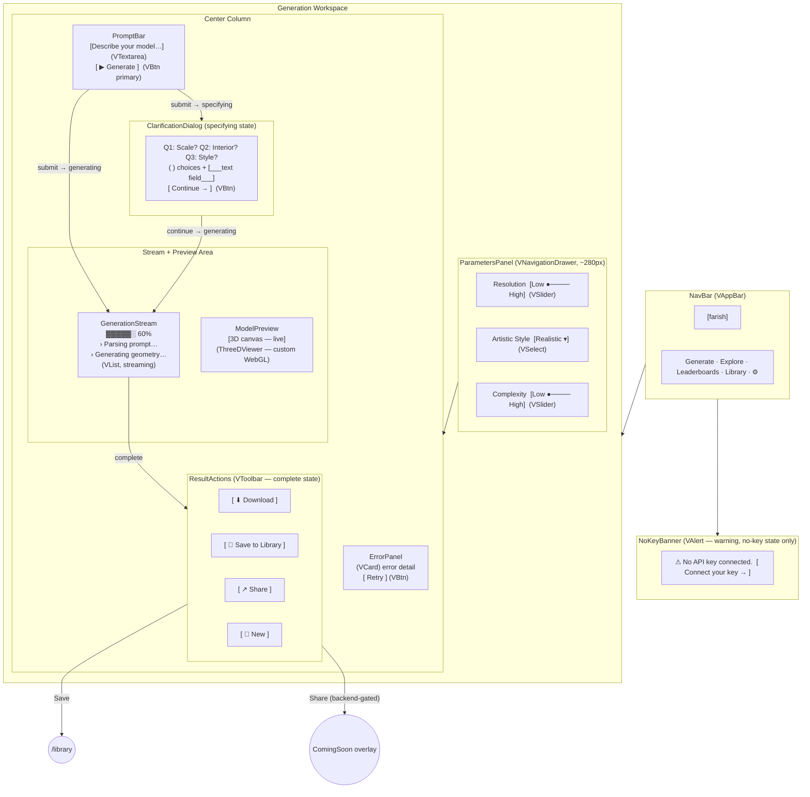

# Generate — Visual Wireframe

## Component Key

| Wireframe Label     | Vuetify 3 Component                                      |
| ------------------- | -------------------------------------------------------- |
| NavBar              | `VAppBar` + `VBtn`                                       |
| NoKeyBanner         | `VAlert` (type="warning")                               |
| PromptBar           | `VTextarea` + `VBtn`                                     |
| ParametersPanel     | `VNavigationDrawer` (secondary, collapsible)             |
| ResSlider           | `VSlider`                                                |
| StyleSelect         | `VSelect`                                                |
| GenerationStream    | `VList` + `VListItem` (streaming, auto-scroll)           |
| ModelPreview        | Custom WebGL canvas in `VCard`                           |
| ClarificationDialog | Inline `VCard` / `VDialog` with radio inputs + text      |
| ResultActions       | `VToolbar` + `VBtn` group                                |
| ErrorPanel          | `VCard` (variant="outlined", color="error") + `VBtn`     |

## State Impact

- **`no-key`**: `NoKeyBanner` visible; Generate `VBtn` disabled.
- **`specifying`**: `ClarificationArea` visible; `StreamArea` hidden; `PromptBar` locked.
- **`generating`**: `StreamArea` visible with live updates; Cancel `VBtn` shown; `ResultActions` hidden.
- **`complete`**: `ModelPreview` shows final model; `ResultActions` visible.
- **`error`**: `ErrorPanel` replaces `StreamArea`; `ResultActions` hidden.
