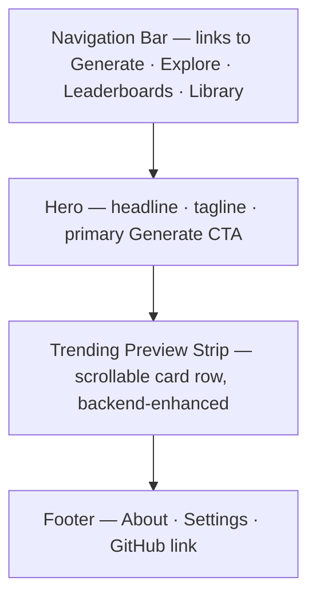

# Home

## Summary

The landing page introduces farish to new and returning visitors, presents the
primary call-to-action into the Generate page, and shows a preview strip of
trending models. The strip is backend-enhanced: it populates from the shared
model store when available and degrades gracefully to a static hero when the
backend is unreachable.[^1]

## Route & Access

- **Route:** `/`
- **Tag:** `static` — ships fully functional without a backend.[^2]
- **Preconditions:** None. Publicly accessible with no authentication or API key
  required.

## Users & Entry Points

- **New visitors** arriving via direct URL, organic search, or a shared link.
- **Returning users** via bookmarks or the site logo from any inner page.
- No referrer precondition — this is the root of the site.

## Layout

## Components

- **NavBar** — site-wide top bar with links to Generate, Explore, Leaderboards,
  My Library, and a Settings icon.
- **HeroSection** — headline ("AI-generated 3D models, instantly"), brief
  tagline explaining farish, and the primary CTA button.
- **GenerateCTA** — primary button linking to [`../generate/SPEC.md`](../generate/SPEC.md).
- **TrendingStrip** — horizontally scrollable row of `ModelCard` components
  sourced from the most-viewed models endpoint; hidden in the `degraded` state.
- **ModelCard** — thumbnail preview, model title, and author chip; navigates to
  [`../model-detail/SPEC.md`](../model-detail/SPEC.md) on click.
- **Footer** — links to About, Settings, and the project GitHub repository.

## States

| State      | Trigger                                 | Renders                                             |
| ---------- | --------------------------------------- | --------------------------------------------------- |
| `default`  | Backend reachable, trending fetch done  | Hero + populated TrendingStrip                      |
| `loading`  | Trending fetch in flight                | Hero + TrendingStrip with skeleton cards            |
| `degraded` | Trending fetch failed or backend absent | Hero only; TrendingStrip hidden with no error shown |

## Interactions

- **Click GenerateCTA** → navigate to `/generate`.
- **Click a ModelCard in TrendingStrip** → navigate to `/m/:modelId`.
- **Click Explore in NavBar** → navigate to `/explore`.
- **Click Leaderboards in NavBar** → navigate to `/leaderboards`.
- **Click My Library in NavBar** → navigate to `/library`.
- **Click Settings icon** → navigate to `/settings`.

## Data

- `trendingModels` — list of top-N most-viewed models (id, title, thumbnailUrl,
  authorName). `remote`, read-only. The strip is suppressed (not errored) when
  this fetch fails.

## Navigation

**In-links:** root URL (`/`); site logo in NavBar from every page.

**Out-links:**
- `/generate` — primary CTA and NavBar
- `/explore` — NavBar
- `/leaderboards` — NavBar
- `/library` — NavBar
- `/m/:modelId` — TrendingStrip cards
- `/settings` — NavBar icon
- `/about` — Footer

## Responsive

Desktop (default): hero spans full viewport width; TrendingStrip scrolls
horizontally in a single row. Mobile/narrow: hero copy stacks vertically,
CTA button goes full-width; TrendingStrip becomes a 2-column card grid.

## Open Questions

- Should TrendingStrip surface Most Viewed, Best Rated, or Most Rated models?
  Defaulting to Most Viewed for "trending" semantics — revisit once the
  leaderboard data model is settled.[^3]

## References

[^1]: Initial prompt — home page description with degradable trending strip —
      [`../INITIAL_PROMPT.md`](../INITIAL_PROMPT.md).
[^2]: INDEX.md — Home tagged `static` —
      [`../INDEX.md`](../INDEX.md).
[^3]: Leaderboard time-bucket design —
      [`../leaderboards/SPEC.md`](../leaderboards/SPEC.md).
