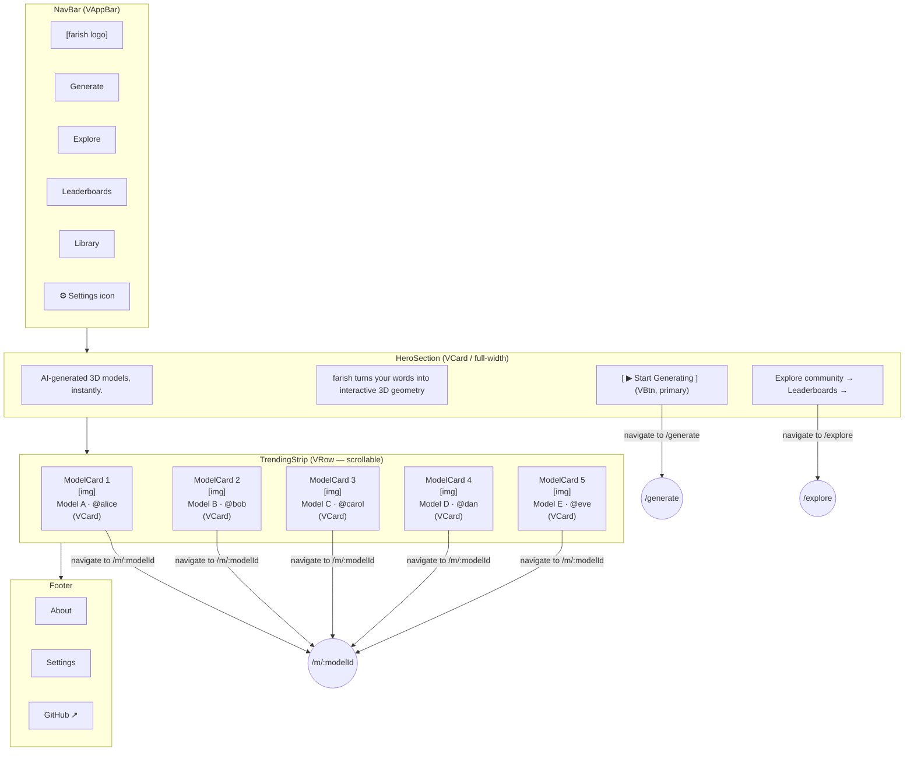

# Home — Visual Wireframe

## Component Key

| Wireframe Label   | Vuetify 3 Component                      |
| ----------------- | ---------------------------------------- |
| NavBar            | `VAppBar` + `VBtn`                       |
| HeroSection       | Full-width `VCard` or plain `<section>`  |
| GenerateCTA       | `VBtn` (variant="elevated", color="primary") |
| TrendingStrip     | `VRow` (overflow-x scroll)               |
| ModelCard         | `VCard` (with thumbnail slot)            |
| Footer            | Static `<footer>` with `VBtn` text links |

## State Impact

- **`loading`**: TrendingStrip cards replaced by `VSkeletonLoader` components.
- **`degraded`**: TrendingStrip subgraph removed from the diagram; Hero and Footer remain.
