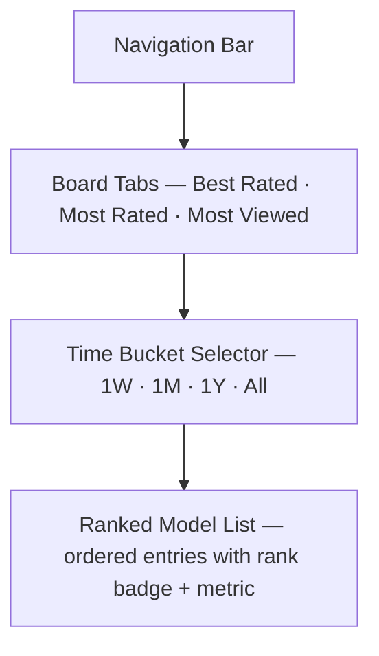

# Leaderboards

## Summary

Three ranked boards — Best Rated, Most Rated (Popular), and Most Viewed — each
filterable by four time buckets: 1 week, 1 month, 1 year, and all time.[^1]
The page ships as a Coming Soon placeholder until the shared backend exists.

## Route & Access

- **Route:** `/leaderboards`
- **Tag:** `backend` — ships as Coming Soon.[^2]
- **Preconditions:** None — leaderboards are publicly visible without login or
  API key.

## Users & Entry Points

- **Discovery browsers** wanting to find the highest-quality or most popular
  community models.
- **Competitive creators** checking where their own models rank.
- Entry from: NavBar (all pages), Home hero section (secondary link).

## Layout

## Components

- **BoardTabs** — three tabs selecting the active ranking metric.
- **TimeBucketSelector** — four toggle buttons (1W / 1M / 1Y / All); updates
  URL param on selection.
- **RankedList** — ordered list of up to 50 `RankedModelCard` entries.
- **RankedModelCard** — rank badge (1–50), thumbnail, model title, author chip,
  and the board's metric value (average rating / rating count / view count).
- **EmptyState** — "No models ranked yet for this period."
- **ComingSoonOverlay** — full-page overlay from
  [`../coming-soon/SPEC.md`](../coming-soon/SPEC.md) shown until backend is live.

## States

| State         | Trigger                              | Renders                                          |
| ------------- | ------------------------------------ | ------------------------------------------------ |
| `coming-soon` | Backend not yet live                 | ComingSoonOverlay over ghost wireframe            |
| `default`     | Board data loaded                    | Tabs + Bucket selector + populated RankedList    |
| `loading`     | Fetch in flight after tab/bucket change | Tabs + Bucket + RankedList with skeleton rows |
| `empty`       | No models qualify for this period    | EmptyState message                               |
| `error`       | Fetch failed                         | Inline error card with Retry button              |

## Interactions

- **Click a BoardTab** → update `?board=` URL param → re-fetch rankings.
- **Click a TimeBucket button** → update `?period=` URL param → re-fetch.
- **Click a RankedModelCard** → navigate to `/m/:modelId`.
- **Click an author chip** → navigate to `/u/:username`.

## Data

- `boardType` — active board (rated|popular|viewed). `local` (URL param
  `?board=`).
- `timeBucket` — active time window (1w|1m|1y|all). `local` (URL param
  `?period=`).
- `rankings` — ordered list of model records with rank position and metric
  value (id, title, thumbnailUrl, authorName, rank, metricValue). `remote`,
  read-only.

## Navigation

**In-links:** NavBar (all pages); Home hero secondary link.

**Out-links:**
- `/m/:modelId` — RankedModelCard click
- `/u/:username` — author chip click

## Responsive

Desktop (default): BoardTabs and TimeBucketSelector in a top bar row;
RankedList full-width below. Mobile/narrow: BoardTabs scroll horizontally;
TimeBucketSelector becomes a compact dropdown; RankedModelCard drops the
thumbnail, showing text-only rank + title + metric.

## Open Questions

- **List length.** Defaulting to top 50 per board/period; adjust once API
  performance is known.
- **Tie-breaking.** When models share the same metric value, tie-break rule
  (e.g., earlier creation date wins) is deferred to API design.[^3]

## References

[^1]: Initial prompt — "best rated (1w/1m/1y/all), most rated (aka popular)
      (1w/1m/1y/all), most viewed (same buckets)" —
      [`../INITIAL_PROMPT.md`](../INITIAL_PROMPT.md).
[^2]: INDEX.md — Leaderboards tagged `backend`, ships as Coming Soon —
      [`../INDEX.md`](../INDEX.md).
[^3]: Explore page for shared browse context —
      [`../explore/SPEC.md`](../explore/SPEC.md).
