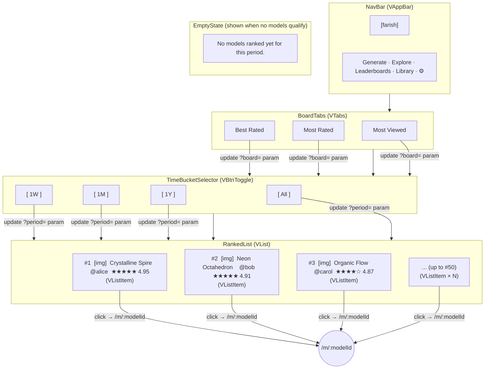

# Leaderboards — Visual Wireframe

## Component Key

| Wireframe Label       | Vuetify 3 Component                             |
| --------------------- | ----------------------------------------------- |
| NavBar                | `VAppBar` + `VBtn`                              |
| BoardTabs             | `VTabs` + `VTab`                                |
| TimeBucketSelector    | `VBtnToggle` (or `VTabs` secondary row)         |
| RankedList            | `VList` + `VListItem`                           |
| RankedModelCard       | `VListItem` with avatar, title, subtitle slots  |
| EmptyState            | `VCard` with centered text                      |

## State Impact

- **`coming-soon`**: Full-page `VOverlay` with ghost list behind `ComingSoonCard`; see `coming-soon-overlay.ascii.md`.
- **`loading`**: RankedList items replaced by `VSkeletonLoader` list items.
- **`empty`**: RankedList replaced by `EmptyState`.
- **`error`**: RankedList replaced by inline error `VCard` + Retry `VBtn`.
- **Board/bucket change**: Updates `?board=` and `?period=` URL params; triggers re-fetch and re-render of RankedList.
