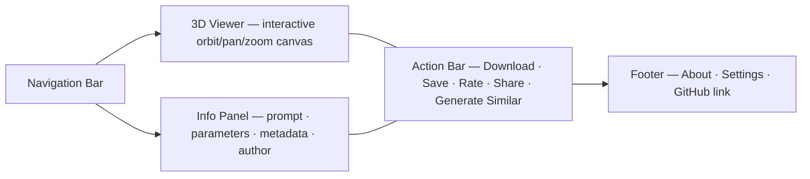

# Model Detail

## Summary

An interactive 3D viewer for a single model alongside its prompt, parameters,
and metadata. The viewer runs entirely client-side for both local (browser-
stored) and remote models. Social actions — rating and sharing — require the
backend and ship as Coming Soon until it is available.[^1]

## Route & Access

- **Route:** `/m/:modelId` — `:modelId` is either a remote UUID (from the
  backend) or a local identifier prefixed `local:` (from browser storage).[^2]
- **Tag:** `browser-only` (viewer); social actions are `backend` (partial).
- **Preconditions:** The model identified by `:modelId` must exist either in
  browser storage or be publicly accessible on the backend. A missing model
  triggers the `error` state.

## Users & Entry Points

- **Creators** viewing their own model after generation or from My Library.
- **Community members** clicking through from Explore, Leaderboards, or a
  shared link.
- **Remixers** wanting to generate a similar model.
- Entry from: [`../generate/SPEC.md`](../generate/SPEC.md) (post-save),
  [`../my-library/SPEC.md`](../my-library/SPEC.md) (card click),
  [`../explore/SPEC.md`](../explore/SPEC.md) (card click),
  [`../leaderboards/SPEC.md`](../leaderboards/SPEC.md) (card click),
  [`../profile/SPEC.md`](../profile/SPEC.md) (card click), direct URL share.

## Layout

## Components

- **NavBar** — site-wide navigation bar; links to Generate, Explore,
  Leaderboards, My Library, and Settings.
- **ThreeDViewer** — WebGL canvas with orbit, pan, and zoom controls; renders
  the model geometry (expected format: GLB).[^3]
- **ViewerControls** — camera-reset, fullscreen, and lighting-preset toggle
  buttons overlaid on the viewer.
- **PromptDisplay** — read-only display of the prompt used to generate the model.
- **ParamsDisplay** — collapsible panel showing generation parameters
  (resolution, style, complexity).
- **MetadataPanel** — author chip, creation date, view count, average rating.
- **AuthorChip** — author avatar + name; links to
  [`../profile/SPEC.md`](../profile/SPEC.md) (coming-soon state until backend).
- **DownloadButton** — triggers browser download of the geometry file.
- **SaveButton** — writes model record to local browser storage (My Library).
- **RatingWidget** — 5-star input; shows coming-soon overlay (backend-gated).
- **ShareButton** — copies canonical URL or shows coming-soon overlay.
- **GenerateSimilarButton** — navigates to `/generate?prompt=<encoded-prompt>`.
- **Footer** — site-wide footer with links to About, Settings, and the project
  GitHub repository.

## States

| State         | Trigger                              | Renders                                                        |
| ------------- | ------------------------------------ | -------------------------------------------------------------- |
| `local`       | `:modelId` starts with `local:`      | Viewer + Info from browser storage; no remote fetch            |
| `loading`     | Remote model fetch in flight         | Skeleton viewer + shimmer on Info panel                        |
| `default`     | Remote model loaded                  | Viewer + Info panel + Action bar                               |
| `error`       | Model not found or fetch failed      | Error card "Model not found" with Back and Retry buttons       |
| `coming-soon` | Rate or Share clicked, no backend    | Dismissible ComingSoonOverlay (action-scoped; ✕ to return to model view) |

## Interactions

- **Orbit / pan / zoom in viewer** → camera transforms; geometry stays fixed.
- **Click camera-reset** → snap back to default camera position.
- **Click fullscreen** → expand viewer to fill the viewport.
- **Click Download** → trigger browser download of the GLB geometry file.
- **Click Save to Library** → write model record to local browser storage.
- **Click Rate** → dismissible coming-soon overlay (backend-gated); user can
  close overlay with ✕ to return to the model view.
- **Click Share** → copy URL to clipboard if model is already published; else
  dismissible coming-soon overlay (same dismiss behavior as Rate).
- **Click Generate Similar** → navigate to
  `/generate?prompt=<url-encoded-prompt>`.
- **Click author chip** → navigate to `/u/:username` (coming-soon state on
  Profile until backend).

## Data

- `model` — model record (id, prompt, params, geometryUrl, thumbnailUrl,
  authorName, authorId, createdAt, viewCount, ratingAvg, ratingCount).
  `remote` for shared models; `local` for browser-stored models.
- `viewerSettings` — camera position and active lighting preset. `local`
  (browser storage; persisted across sessions).
- `userRating` — the current user's own star rating. `remote`, write
  (backend-gated; null until backend exists).

## Navigation

**In-links:** Generate (post-save redirect); My Library (card click); Explore,
Leaderboards, Profile (card clicks); Home (TrendingStrip card click); direct
shared URL.

**Out-links:**
- `/generate` — Generate Similar button (with `?prompt=`)
- `/library` — Save to Library confirmation
- `/u/:username` — AuthorChip
- `/explore` — browser back (no persistent breadcrumb; referrer-aware back button considered for v2)
- `/about`, `/settings`, GitHub — Footer links (present on all pages)

## Responsive

Desktop (default): ThreeDViewer occupies ~65 % of the width; Info panel is a
fixed right sidebar; Action bar sits at the viewer's bottom edge. Mobile/narrow:
viewer goes full-width at top; Info and Actions collapse into accordion sections
below; sticky Download button pinned to the bottom of the screen.

## Open Questions

- **Local model URL scheme.** How is `local:` prefixed in the URL? Consider
  a dedicated sub-route `/m/local/:localId` to keep URL parsing clean.[^4]
- **View count increment.** Should viewing a local model increment a view
  counter when the model is also published remotely? Deferred to API design.

## References

[^1]: INDEX.md — "browser-only viewer, backend social" dual nature —
      [`../INDEX.md`](../INDEX.md).
[^2]: Initial prompt — "interactive 3D viewer … download, share, and rating
      actions" — [`../INITIAL_PROMPT.md`](../INITIAL_PROMPT.md).
[^3]: glTF 2.0 / GLB format — <https://registry.khronos.org/glTF/specs/2.0/glTF-2.0.html>.
[^4]: My Library spec for local model storage —
      [`../my-library/SPEC.md`](../my-library/SPEC.md).
