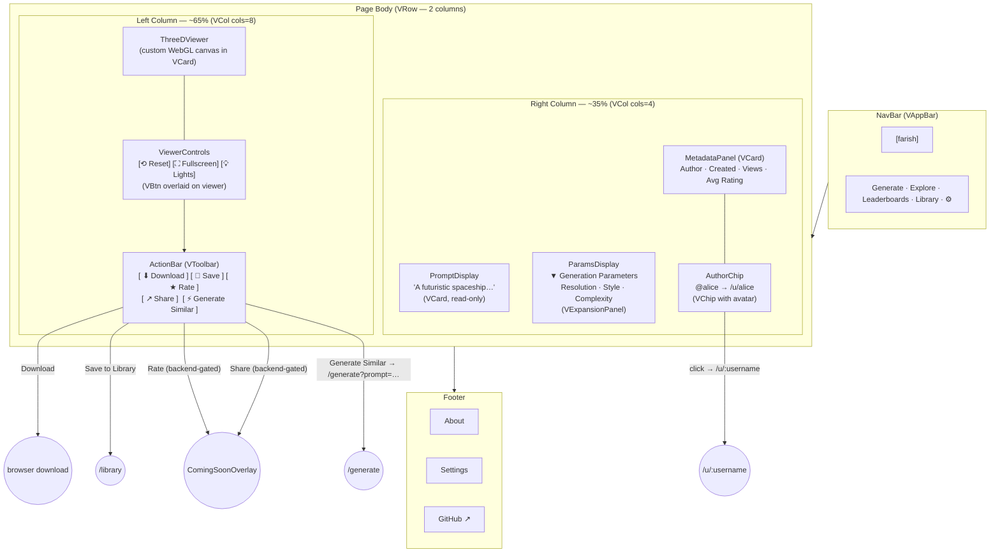

# Model Detail — Visual Wireframe

## Component Key

| Wireframe Label   | Vuetify 3 Component                                        |
| ----------------- | ---------------------------------------------------------- |
| NavBar            | `VAppBar` + `VBtn`                                         |
| ThreeDViewer      | Custom WebGL canvas in `VCard`                             |
| ViewerControls    | `VBtn` group overlaid on viewer (absolute positioning)     |
| PromptDisplay     | `VCard` (read-only text content)                           |
| ParamsDisplay     | `VExpansionPanel` / `VExpansionPanels`                     |
| MetadataPanel     | `VCard` with `VListItem` rows                              |
| AuthorChip        | `VChip` (with avatar + name)                               |
| ActionBar         | `VToolbar` + `VBtn` group                                  |
| RatingWidget      | `VRating` (5-star input, backend-gated)                    |
| Footer            | Static `<footer>` with `VBtn` text links                   |

## State Impact

- **`loading`**: `ThreeDViewer` and `InfoCol` replaced by `VSkeletonLoader`.
- **`local`**: Model loaded from browser storage; no remote fetch; Rate/Share hidden.
- **`error`**: Both columns replaced by error `VCard` with Back and Retry `VBtn`.
- **`coming-soon`**: Dismissible `VOverlay` with `ComingSoonCard` covers the page when Rate/Share clicked; ✕ button returns user to model view.
