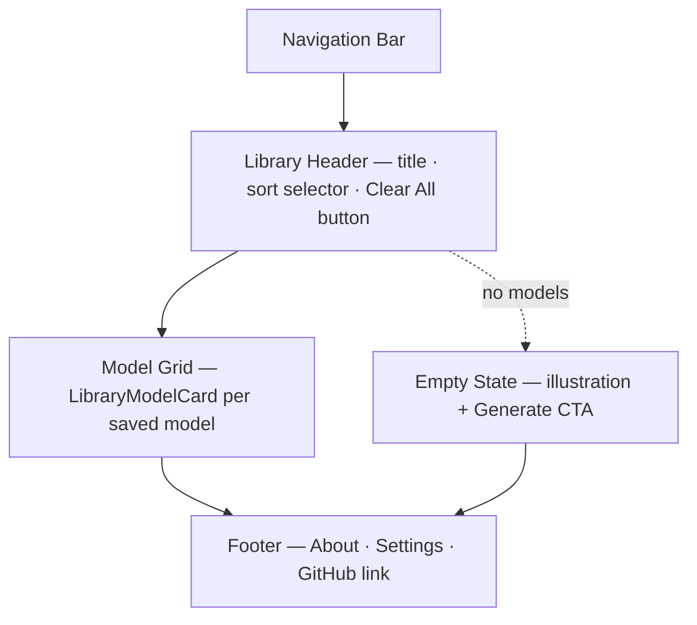

# My Library

## Summary

The current user's personal collection of generated models, stored in browser
local storage. The library works fully offline and without a backend account —
no sign-in is required. Models can be viewed, downloaded, deleted, or (once the
backend exists) shared directly from this page.[^1]

## Route & Access

- **Route:** `/library`
- **Tag:** `browser-only` — reads and writes only to browser local storage.[^2]
- **Preconditions:** None. An API key is not required to view previously saved
  models; it is only needed to generate new ones.

## Users & Entry Points

- **Creators** who have generated one or more models and want to manage them.
- **Returners** who saved a model in a prior session and want to retrieve it.
- Entry from: [`../generate/SPEC.md`](../generate/SPEC.md) ("Save to Library"
  action); [`../model-detail/SPEC.md`](../model-detail/SPEC.md) (Save action);
  NavBar "Library" link.

## Layout

## Components

- **NavBar** — site-wide navigation bar; links to Generate, Explore,
  Leaderboards, My Library, and Settings.
- **LibraryHeader** — page title ("My Library"), sort dropdown, and a
  "Clear All" button that triggers a confirmation dialog.
- **ModelGrid** — responsive card grid; switches to `EmptyState` when the
  library is empty.
- **LibraryModelCard** — model thumbnail, title, creation date, and an actions
  menu (View, Download, Delete).
- **EmptyState** — illustrative placeholder with a "Generate your first model"
  CTA linking to [`../generate/SPEC.md`](../generate/SPEC.md).
- **DeleteConfirmDialog** — modal asking the user to confirm before removing a
  model from storage.
- **Footer** — site-wide footer with links to About, Settings, and the project
  GitHub repository.

## States

| State     | Trigger                          | Renders                                          |
| --------- | -------------------------------- | ------------------------------------------------ |
| `default` | One or more models in storage    | LibraryHeader + populated ModelGrid              |
| `empty`   | No models in browser storage     | LibraryHeader (no Clear All) + EmptyState        |
| `loading` | Storage read in progress (brief) | LibraryHeader + skeleton card grid               |

## Interactions

- **Click a LibraryModelCard** → navigate to `/m/local:<localId>`.
- **Click Download in card actions** → trigger browser download of the GLB
  geometry file.
- **Click Delete in card actions** → open DeleteConfirmDialog.
- **Confirm delete** → remove model from storage → update grid; if last model,
  switch to `empty` state.
- **Change sort selector** → re-order grid in place (no fetch).
- **Click Clear All** → confirmation dialog → clear all models from storage →
  switch to `empty` state.
- **Click Generate CTA** (empty state) → navigate to `/generate`.

## Data

- `libraryModels` — list of saved model records (id, prompt, thumbnailUrl,
  geometryBlob, params, createdAt). `local` (browser storage), read/write.
- `sortPreference` — active sort order (date-desc | date-asc | name-asc).
  `local` (persisted preference, browser storage).

## Navigation

**In-links:** Generate ("Save to Library" post-action); Model Detail (Save
action); NavBar "Library" link.

**Out-links:**
- `/m/local:<localId>` — LibraryModelCard click
- `/generate` — EmptyState CTA
- `/about`, `/settings`, GitHub — Footer links (present on all pages)

## Responsive

Desktop (default): 3–4 column ModelGrid. Mobile/narrow: 2-column grid;
LibraryModelCard actions exposed via a long-press menu or a swipe-to-reveal
action strip.

## Open Questions

- **Cross-device sync.** Should the library sync to the backend once a user
  is signed in? Deferred to post-backend implementation; the local-only model
  must remain the foundation.[^3]
- **Storage quota.** Geometry blobs can be large; the page should gracefully
  handle `QuotaExceededError` from the storage API — surface in Open Questions
  for the implementation step.

## References

[^1]: INDEX.md — "current user's own generated models, stored in the browser
      so the library works offline and without an account" —
      [`../INDEX.md`](../INDEX.md).
[^2]: Initial prompt — browser-only constraint; backend deferred —
      [`../INITIAL_PROMPT.md`](../INITIAL_PROMPT.md).
[^3]: Model Detail for the local model URL scheme —
      [`../model-detail/SPEC.md`](../model-detail/SPEC.md).
