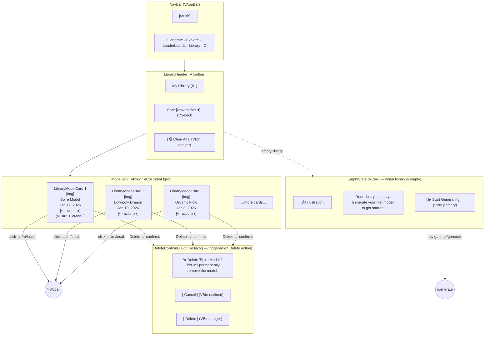

# My Library — Visual Wireframe

## Component Key

| Wireframe Label        | Vuetify 3 Component                                     |
| ---------------------- | ------------------------------------------------------- |
| NavBar                 | `VAppBar` + `VBtn`                                      |
| LibraryHeader          | `VToolbar` with title, `VSelect`, `VBtn`                |
| ModelGrid              | `VRow` / `VCol` (cols="12" sm="6" md="4" lg="3")       |
| LibraryModelCard       | `VCard` with thumbnail, title, date, `VMenu`            |
| EmptyState             | `VCard` (centered illustration + `VBtn`)                |
| DeleteConfirmDialog    | `VDialog` (width=400, non-persistent)                   |
| SortSelect             | `VSelect`                                               |
| ClearAllBtn            | `VBtn` (color="error")                                  |

## State Impact

- **`loading`**: ModelGrid replaced by `VSkeletonLoader` cards.
- **`empty`**: `LibraryHeader` shown without ClearAll/Sort; `ModelGrid` replaced by `EmptyState`.
- **Delete action**: `DeleteConfirmDialog` (VDialog) opens; on confirm, card removed; last card → switches to `empty` state.
