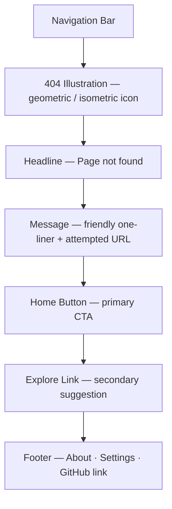

# Not Found

## Summary

The 404 page rendered for any route that does not match a known page. Keeps
the experience friendly and recoverable — a clear error message, a primary
link back to Home, and a secondary suggestion to search Explore.[^1]

## Route & Access

- **Route:** `/*` — Vue Router catch-all; matched when no other route applies.
- **Tag:** `system` — infrastructure page, no data dependency.[^2]
- **Preconditions:** None.

## Users & Entry Points

- **Users** who typed an incorrect URL or followed a stale/broken link.
- **Bots** crawling non-existent paths.
- No specific entry referrer — any unknown URL triggers this page.

## Layout

## Components

- **NavBar** — site-wide navigation bar; links to Generate, Explore,
  Leaderboards, My Library, and Settings.
- **NotFoundIllustration** — an isometric or geometric graphic evoking the
  project's aesthetic; displays the numeral "404" or equivalent.
- **NotFoundHeadline** — "Page not found" in the site's heading typeface.
- **NotFoundMessage** — one-sentence friendly explanation, optionally showing
  the attempted path (e.g., "We couldn't find `{path}`").
- **HomeButton** — primary button linking to `/`.
- **ExploreLink** — secondary text link: "Try searching in Explore" linking
  to `/explore`.
- **Footer** — site-wide footer with links to About, Settings, and the project
  GitHub repository.

## States

| State     | Trigger               | Renders                                           |
| --------- | --------------------- | ------------------------------------------------- |
| `default` | Unknown route matched | Illustration + Headline + Message + action buttons |

## Interactions

- **Click HomeButton** → navigate to `/`.
- **Click ExploreLink** → navigate to `/explore`.

## Data

_None._ The attempted path may be read from the router for display in
`NotFoundMessage` but is not persisted or sent anywhere.

## Navigation

**In-links:** Any broken or unknown URL navigated by the browser or router.

**Out-links:**
- `/` — HomeButton
- `/explore` — ExploreLink
- `/about`, `/settings`, GitHub — Footer links (present on all pages)

## Responsive

Desktop (default): content centered vertically and horizontally; illustration
above the text block. Mobile/narrow: same layout; illustration scales down to
fit; buttons go full-width.

## Open Questions

- **Route suggestion.** Should the page attempt to surface the nearest matching
  route? Deferred — too complex for v1; a simple Home + Explore pair is
  sufficient.[^3]

## References

[^1]: Initial prompt — "Not Found — The 404 page for unknown routes" —
      [`../INITIAL_PROMPT.md`](../INITIAL_PROMPT.md).
[^2]: INDEX.md — Not Found tagged `system` —
      [`../INDEX.md`](../INDEX.md).
[^3]: Vue Router catch-all route documentation —
      <https://router.vuejs.org/guide/essentials/dynamic-matching.html#catch-all-404-not-found-route>.
