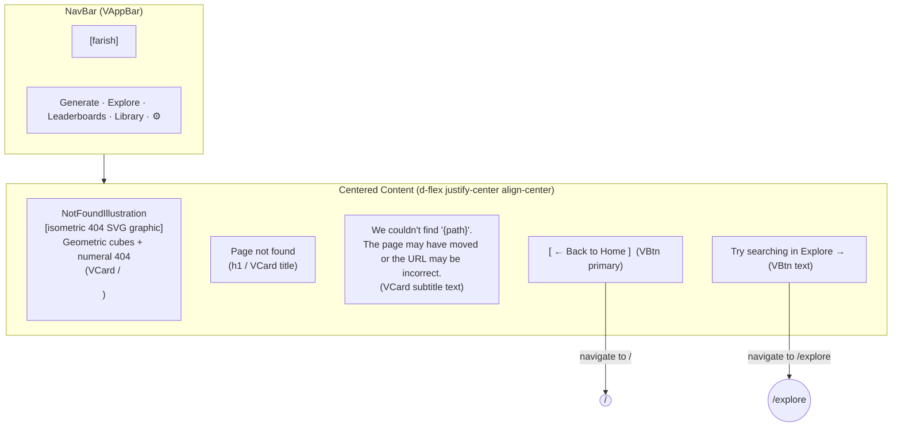

# Not Found (404) — Visual Wireframe

## Component Key

| Wireframe Label        | Vuetify 3 Component                                     |
| ---------------------- | ------------------------------------------------------- |
| NavBar                 | `VAppBar` + `VBtn`                                      |
| NotFoundIllustration   | Custom SVG in `<figure>` or `VCard` image slot          |
| NotFoundHeadline       | `<h1>` styled with Vuetify typography classes           |
| NotFoundMessage        | `
` text; `{path}` read from Vue Router `$route.path` |
| HomeButton             | `VBtn` (variant="elevated", color="primary")            |
| ExploreLink            | `VBtn` (variant="text")                                 |

## State Impact

Single state only (`default`). The attempted path (`{path}`) is read from
`$route.path` and displayed in `NotFoundMessage` — no storage or API calls.
