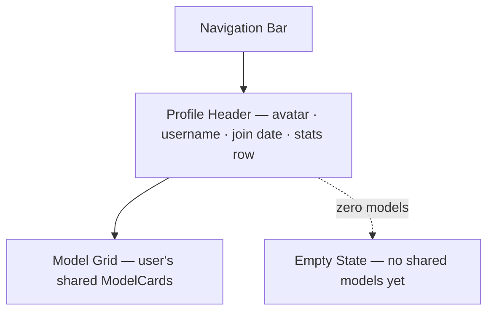

# Profile

## Summary

A public profile page showing a creator's shared models alongside summary
stats — total models shared, average rating received, and cumulative view
count. The page ships as a Coming Soon placeholder until the shared backend
exists.[^1]

## Route & Access

- **Route:** `/u/:username` — `:username` is the creator's public handle.
- **Tag:** `backend` — ships as Coming Soon; requires the shared model store
  and user account system.[^2]
- **Preconditions:** None — profiles are publicly visible without login.
  The `:username` must resolve to an existing account; an unknown username
  triggers the `error` state.

## Users & Entry Points

- **Fans and collaborators** wanting to see all shared work by a specific
  creator.
- **Creators** checking their own public presence.
- Entry from: [`../model-detail/SPEC.md`](../model-detail/SPEC.md) (author
  chip); [`../explore/SPEC.md`](../explore/SPEC.md) (author chip);
  [`../leaderboards/SPEC.md`](../leaderboards/SPEC.md) (author chip).

## Layout

## Components

- **NavBar** — site-wide navigation bar; links to Generate, Explore,
  Leaderboards, My Library, and Settings.
- **ProfileHeader** — avatar image, display name, username handle, join date,
  and a stats row (model count, average rating, total views).
- **StatsBadge** — individual stat chip reused within ProfileHeader.
- **ModelGrid** — responsive grid of `ModelCard` showing the user's public
  models, newest first by default.
- **ModelCard** — thumbnail, title, rating, views; links to
  [`../model-detail/SPEC.md`](../model-detail/SPEC.md).
- **EmptyState** — "No shared models yet" message.
- **ComingSoonOverlay** — full-page overlay from
  [`../coming-soon/SPEC.md`](../coming-soon/SPEC.md) shown until backend is live.

## States

| State         | Trigger                          | Renders                                             |
| ------------- | -------------------------------- | --------------------------------------------------- |
| `coming-soon` | Backend not yet live             | ComingSoonOverlay over ghost wireframe               |
| `loading`     | Profile data fetch in flight     | Skeleton ProfileHeader + skeleton ModelGrid          |
| `default`     | Profile and models loaded        | ProfileHeader + populated ModelGrid                 |
| `empty`       | User has no shared models        | ProfileHeader + EmptyState message                  |
| `error`       | Username not found / fetch fails | Error card "Profile not found" with Home link       |

## Interactions

- **Click a ModelCard** → navigate to `/m/:modelId`.
- **Click author in ModelCard** → same page if same user (no-op or scroll top).

## Data

- `userProfile` — user record (username, displayName, avatarUrl, joinDate,
  modelCount, avgRating, totalViews). `remote`, read-only.
- `userModels` — paginated list of the user's shared models (id, title,
  thumbnailUrl, ratingAvg, viewCount, createdAt). `remote`, read-only.

## Navigation

**In-links:** Model Detail author chip; Explore author chip; Leaderboards
author chip.

**Out-links:**
- `/m/:modelId` — ModelCard click

## Responsive

Desktop (default): ProfileHeader full-width banner with stats inline;
ModelGrid 3–4 columns. Mobile/narrow: avatar and stats stack vertically;
ModelGrid drops to 2 columns.

## Open Questions

- **Username source.** Is the public handle derived from the Claude OAuth
  account name, or is it a separate farish-specific field? Deferred to
  authentication design.[^3]
- **Pagination.** How many models per page? Default to 24 with a Load More
  button; confirm during API design.

## References

[^1]: INDEX.md — "public user's models and stats … backend" —
      [`../INDEX.md`](../INDEX.md).
[^2]: Initial prompt — social/sharing features require shared backend —
      [`../INITIAL_PROMPT.md`](../INITIAL_PROMPT.md).
[^3]: Settings spec for authentication/connection model —
      [`../settings/SPEC.md`](../settings/SPEC.md).
