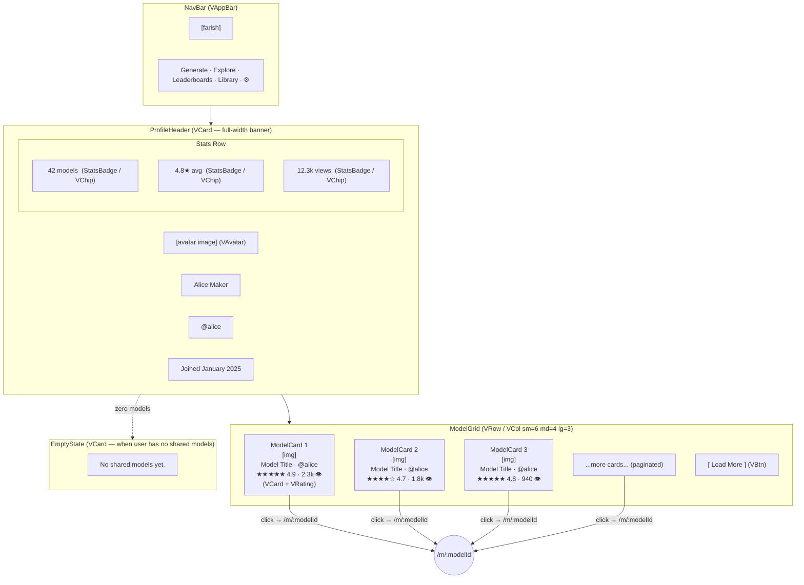

# Profile — Visual Wireframe

## Component Key

| Wireframe Label   | Vuetify 3 Component                                    |
| ----------------- | ------------------------------------------------------ |
| NavBar            | `VAppBar` + `VBtn`                                     |
| ProfileHeader     | `VCard` (full-width, banner style)                     |
| Avatar            | `VAvatar`                                              |
| StatsBadge        | `VChip` (non-clickable, informational)                 |
| ModelGrid         | `VRow` / `VCol` (cols="12" sm="6" md="4" lg="3")      |
| ModelCard         | `VCard` + `VRating`                                    |
| EmptyState        | `VCard` (centered text)                                |
| LoadMore          | `VBtn` (variant="text")                                |

## State Impact

- **`coming-soon`**: Full-page `VOverlay` with ghost cards behind `ComingSoonCard`; see `coming-soon-overlay.ascii.md`.
- **`loading`**: `ProfileHeader` and ModelGrid replaced by `VSkeletonLoader`.
- **`empty`**: ModelGrid replaced by `EmptyState`.
- **`error`**: Page content replaced by "Profile not found" `VCard` + Home `VBtn`.
