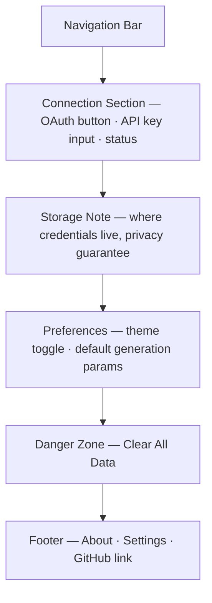

# Settings

## Summary

The Settings page is the login and key-management surface for farish — there is
no separate Login page.[^1] Users connect a Claude account via OAuth or enter an
API key manually. All credentials are stored in the browser and never sent to
farish servers. Preferences (theme, default generation parameters) and a
local-data management section complete the page.

## Route & Access

- **Route:** `/settings`
- **Tag:** `browser-only` — reads and writes only to browser local storage.[^2]
- **Preconditions:** None. Any visitor may view and update settings without
  being connected. The page accepts a `?return=` query param so Generate's
  NoKeyBanner can deep-link back after a successful connection.

## Users & Entry Points

- **New users** directed from Generate's `no-key` NoKeyBanner.
- **Connected users** wanting to change their key or update preferences.
- Entry from: [`../generate/SPEC.md`](../generate/SPEC.md) (NoKeyBanner);
  NavBar Settings icon (all pages); [`../about/SPEC.md`](../about/SPEC.md)
  (credential-privacy section link).

## Layout

## Components

- **NavBar** — site-wide navigation bar; links to Generate, Explore,
  Leaderboards, My Library, and Settings.
- **ConnectionStatus** — banner showing "Connected as \<name\>" (OAuth) or
  "API key set" (manual) or "Not connected".
- **ConnectWithClaudeButton** — initiates the Claude OAuth flow.[^3]
- **APIKeyInput** — password-type text input with show/hide toggle and a Save
  button; accepts a `sk-ant-…` format API key.
- **DisconnectButton** — clears all stored credentials; shown only when
  connected.
- **StorageNote** — plain-prose explanation that credentials are stored in
  `localStorage` and never transmitted to farish servers.
- **ThemeToggle** — light / dark / system three-way toggle.
- **DefaultParamsEditor** — sliders and selects for default resolution, style,
  and complexity (mirrors ParametersPanel in Generate).
- **ClearDataButton** — triggers a confirmation dialog then wipes all browser
  storage (credentials, library, preferences).
- **Footer** — site-wide footer with links to About, Settings, and the project
  GitHub repository.

## States

| State             | Trigger                         | Renders                                              |
| ----------------- | ------------------------------- | ---------------------------------------------------- |
| `disconnected`    | No token or key in storage      | ConnectWithClaudeButton + APIKeyInput (empty)        |
| `connecting`      | OAuth popup opened              | Loading indicator on ConnectWithClaudeButton         |
| `connected-oauth` | OAuth token stored              | ConnectionStatus (name) + DisconnectButton           |
| `connected-key`   | Manual API key stored           | ConnectionStatus ("API key set") + DisconnectButton  |
| `error`           | OAuth failed or key rejected    | Inline error message below the relevant control      |

## Interactions

- **Click Connect with Claude** → open OAuth popup/redirect → on success, store
  token → switch to `connected-oauth`; on failure, show `error`.
- **Enter API key + click Save** → validate key prefix format → store in
  `localStorage` → switch to `connected-key`; if invalid format, show error.
- **Click Disconnect** → clear token/key from storage → switch to
  `disconnected`; library and preferences are NOT cleared.
- **Toggle theme** → persist choice → apply CSS class immediately (no reload).
- **Edit DefaultParams** → auto-save to storage on blur/change.
- **Click Clear All Data** → confirmation dialog → wipe entire
  `localStorage` for farish → redirect to `/` with a cleared-session notice.
- **Successful connection with `?return=` param** → redirect to the return URL
  after storing credentials.

## Data

- `apiToken` — Claude OAuth access token OR manual API key string. `local`
  (browser storage; stored securely, never logged or transmitted).
- `connectionType` — active connection method (oauth | manual | none). `local`.
- `connectedUsername` — display name from the Claude OAuth response (null for
  manual key). `local`.
- `theme` — active theme preference (light | dark | system). `local`.
- `defaultParams` — default generation parameters object. `local`.

## Navigation

**In-links:** Generate NoKeyBanner (with `?return=/generate`); NavBar
Settings icon; About credential-privacy link.

**Out-links:**
- `?return=` target URL — after successful connection
- `/about` — credential-privacy details link (StorageNote + Footer)
- GitHub — Footer link

## Responsive

Desktop (default): settings content in a centered container (max-width ~640 px);
section headings and controls laid out with generous spacing. Mobile/narrow:
container goes full-width; OAuth button and APIKeyInput span full width;
DefaultParamsEditor sliders become larger touch targets.

## Open Questions

- **Claude OAuth availability.** The initial prompt notes "preferably
  login-with-Claude but I think they'll need to provide a token".[^4] Confirm
  whether Anthropic exposes a public OAuth flow; API-key fallback is the safe
  default.
- **Key format validation.** Validating only the `sk-ant-` prefix client-side
  is lightweight but can show false positives. Accept this trade-off and let
  the first actual API call surface a bad key.

## References

[^1]: INDEX.md — "Settings is the connect surface — no separate Login page" —
      [`../INDEX.md`](../INDEX.md).
[^2]: Initial prompt — "user can input their claude-code api key or oauth api
      key" and browser-only storage requirement —
      [`../INITIAL_PROMPT.md`](../INITIAL_PROMPT.md).
[^3]: Claude API key documentation —
      <https://docs.anthropic.com/en/api/getting-started>.
[^4]: Initial prompt amendment A3 context; "preferably login-with-claude" —
      [`../INITIAL_PROMPT.md`](../INITIAL_PROMPT.md).
