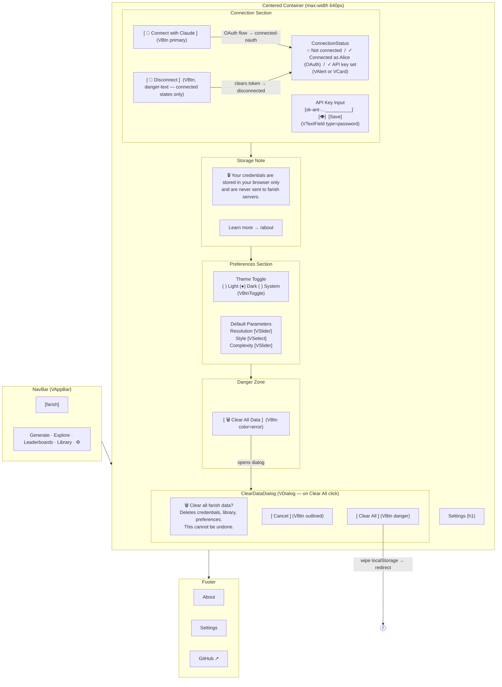

# Settings — Visual Wireframe

## Component Key

| Wireframe Label         | Vuetify 3 Component                                   |
| ----------------------- | ----------------------------------------------------- |
| NavBar                  | `VAppBar` + `VBtn`                                    |
| ConnectionStatus        | `VAlert` or `VCard` (status indicator)                |
| ConnectWithClaudeButton | `VBtn` (variant="elevated", prepend-icon="mdi-key")   |
| APIKeyInput             | `VTextField` (type="password", show/hide toggle)       |
| DisconnectButton        | `VBtn` (variant="text", color="error")                |
| StorageNote             | Static prose in `VCard` or `VAlert` (type="info")     |
| ThemeToggle             | `VBtnToggle` (three-way: light/dark/system)           |
| DefaultParamsEditor     | `VSlider` + `VSelect`                                 |
| ClearDataButton         | `VBtn` (color="error")                                |
| ClearDataDialog         | `VDialog` (width=440)                                 |
| Footer                  | Static `<footer>` with `VBtn` text links              |

## State Impact

- **`disconnected`**: `ConnectBtn` + `APIKeyInput` visible; `DisconnectBtn` hidden; `ConnectionStatus` = "Not connected".
- **`connected-oauth`**: `ConnectionStatus` = "Connected as Alice"; `ConnectBtn` hidden; `DisconnectBtn` visible.
- **`connected-key`**: `ConnectionStatus` = "API key set"; `ConnectBtn` hidden; `DisconnectBtn` visible; `APIKeyInput` shows masked value.
- **`connecting`**: Spinner on `ConnectBtn`; inputs disabled.
- **`error`**: Inline `VAlert` (error type) below the failing control.
