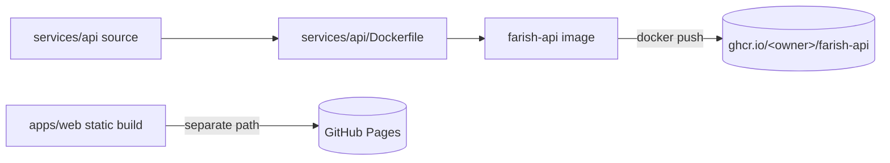

# Publishing to ghcr.io

All farish container/package publishing targets the **GitHub Container
Registry** ([ghcr.io][ghcr]) — initial prompt step 26.

## What gets published

The only publishable artifact in the step-26 skeleton is the **`@farish/api`
service**, packaged as a container image. The browser app (`@farish/web`) is a
static site published to GitHub Pages, not a container — it never goes to
ghcr.io.



## Local dev does NOT use this

Tilt runs the API server as a **native process** for local development (see
[`docs/monorepo/tilt.md`](../docs/monorepo/tilt.md)). The container image is
only the **publishing** form of the service. Building or pushing the image is
never part of `tilt up`.

## How to publish

The `release` run-script for `services/api` is
[`.mise/tasks/publish-api.sh`](../.mise/tasks/publish-api.sh):

```sh
# Build the image only (validation — no registry needed):
bun run --cwd services/api release

# Build AND push to ghcr.io (requires `docker login ghcr.io` first):
PUBLISH=true bun run --cwd services/api release
```

| Variable     | Default   | Purpose                              |
| ------------ | --------- | ------------------------------------ |
| `GHCR_OWNER` | `nsheaps` | The ghcr.io namespace (org or user). |
| `IMAGE_TAG`  | `dev`     | The image tag.                       |
| `PUBLISH`    | _(unset)_ | Set to `true` to actually push.      |

The resulting image is `ghcr.io/<owner>/farish-api:<tag>`.

## Stub status

The publish step is intentionally a **gated stub**: the push only fires when
`PUBLISH=true`, so it can never run by accident. Wiring it into an automated
release workflow — with `GITHUB_TOKEN`-based `docker login ghcr.io`,
multi-arch builds, and image tagging from git refs — is a later prompt step.
The Dockerfile and the release script establish the target now so that step
only has to connect credentials and a trigger.

### Authenticating in CI (reference)

A future release workflow logs in with the built-in token:

```yaml
- uses: docker/login-action@v3
  with:
    registry: ghcr.io
    username: ${{ github.actor }}
    password: ${{ secrets.GITHUB_TOKEN }}
```

## See also

- [`services/api/Dockerfile`](../services/api/Dockerfile) — the image build.
- [`.mise/tasks/publish-api.sh`](../.mise/tasks/publish-api.sh) — the release script.
- [`README.md`](./README.md) — the full infra target table.

[ghcr]: https://docs.github.com/en/packages/working-with-a-github-packages-registry/working-with-the-container-registry
